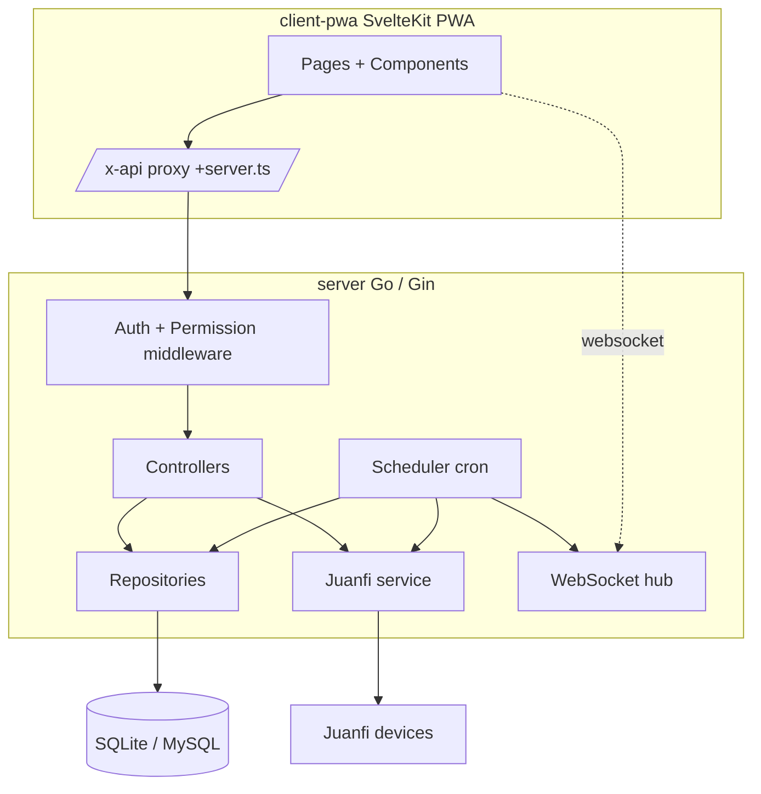

# VendoReport — System Overview & Documentation Index

> Audience: human developers and AI assistants.
> Purpose: single entry point describing the whole system and linking to per-feature docs.
> Terminology is fixed in [Glossary](#glossary) and reused across all feature docs.

## Documentation index

| Doc | Feature | Summary |
|---|---|---|
| [authentication-and-access.md](authentication-and-access.md) | Auth, Users, Roles, Permissions | Login, JWT sessions, password change, RBAC. |
| [vendo-machines.md](vendo-machines.md) | Vendo machines | CRUD, live status, active users, enable/disable, withdraw. |
| [vendo-system-configuration.md](vendo-system-configuration.md) | Vendo system configuration | Read-only device config (network, credentials, coin slot, pins, voucher, etc.), field-mapping confidence reference. |
| [sales-and-withdrawals.md](sales-and-withdrawals.md) | Sales & withdrawals | Sale records, daily/monthly aggregates, withdrawal log. |
| [system-logs.md](system-logs.md) | System logs | Device log persistence, search, manual refresh. |
| [monitoring-and-notifications.md](monitoring-and-notifications.md) | Scheduler, status snapshots, notifications | Cron jobs, status history, WebSocket broadcast. |
| [vendo-rates.md](vendo-rates.md) | Vendo rates | Per-vendo & default rate plans, import/sync to device. |
| [vendo-vouchers.md](vendo-vouchers.md) | Vendo vouchers | Generated voucher codes, device generation, voucher history. |

---

# Overview

## Purpose
- VendoReport is a monitoring and management dashboard for a fleet of **Juanfi-firmware WiFi vending machines** ("vendos").
- It centralizes device status, sales, logs, withdrawals, and pricing (rates), plus user/role administration, behind a single web app.

## Responsibilities
- Persist device data (status snapshots, logs, sales) pulled on a schedule.
- Expose authenticated REST endpoints with permission-based access control.
- Provide a SvelteKit PWA UI.
- Talk to each device over its HTTP API for live status, withdrawals, and rate import/sync.

## Scope
- **In scope:** the Go REST API (`server/`), the SvelteKit PWA (`client-pwa/`), the scheduler, and device integration.
- **Out of scope:** device firmware, network provisioning, the retired Python/Alembic predecessor app.

---

# Architecture

## Components


## Layered structure (backend)
- `cmd/main.go` → config, DB, app wiring, graceful shutdown.
- `app/app.go` → single source of truth for routing (used by server **and** tests).
- `internal/controllers` → HTTP handlers (validation, ACL, response shaping).
- `internal/repository` → DB queries behind interfaces (SOLID DI).
- `internal/services` → Juanfi device client + logger.
- `internal/scheduler` → cron jobs.
- `internal/middleware` → JWT auth + permission checks.
- `internal/websocket` → broadcast hub.

## Frontend structure
- `(auth)/` route group → authenticated pages; `(guest)/login` → public.
- `(auth)/+layout.server.ts` → validates session, loads `user` + `permissions`, proactively refreshes the JWT.
- `src/routes/x-api/[...path]/+server.ts` → proxy that injects the Bearer token from the httpOnly cookie.
- `src/lib/` → shared components, stores, nav ACL (`nav.ts`).

## Tech stack
| Layer | Tech |
|---|---|
| API | Go, Gin, GORM, `robfig/cron`, `golang-jwt/v5`, `gorilla/websocket` |
| DB | SQLite (`mattn/go-sqlite3`, CGO) or MySQL |
| Frontend | SvelteKit 5 (runes), Vite, UIkit, pnpm |

---

# Cross-Cutting Concerns

> These apply to every feature. Each feature doc assumes them.

## Authentication
- All `(auth)`/protected API routes require `Authorization: Bearer <JWT>` (HS256, ~1-hour expiry).
- The PWA stores the JWT in an **httpOnly cookie** and never exposes it to client JS; the `/x-api/` proxy injects it server-side.
- See [authentication-and-access.md](authentication-and-access.md).

## Authorization (permission-based ACL)
- Roles are **created dynamically** (UI/API); there are no hardcoded role names.
- A role holds a list of **permissions**. A user's effective permissions = union of its roles' permissions + always-on defaults.
- Permission strings: `dashboard`, `account`, `vendos`, `sales`, `logs`, `withdrawals`, `rates`, `vouchers`, `settings`, `users`, `vendoconfig`.
- **Always-on defaults** (granted to every user regardless of role): `dashboard`, `account`.
- **Admin** = holds the `users` permission. Equivalent to `assignedVendoIDs(c) == nil` (unrestricted vendo access).
- **Row-level vendo scoping:** non-admins are limited to their assigned vendos via `assignedVendoIDs(c)` / `canAccessVendo(c, id)`. This filters sales, logs, status, withdrawals, and vendos.

## Device integration (Juanfi)
- Every device call: `GET|POST <api_url>/admin/<path>`, header `X-TOKEN: <api_key>`, auto-appended `query=<unix-ms>` param (`buildURL`).
- Most endpoints are GET (even mutating ones); `api/saveRates` is the only POST.
- Per-call HTTP timeout: 5 seconds. Unreachable device → handlers return **502**.
- See `internal/services/juanfi_api.go`.

## Pagination envelope
- Paginated endpoints return `PageResult`: `{ items, total, page, size, pages }`.
- Query params: `page` (default 1), `size` (default per `paginationParams`).

## Persistence
- `DB_DRIVER` = `sqlite` (default) or `mysql`. Connection in `internal/database/database.go`.
- **SQLite migration is create-missing only** — it never alters existing tables (`sqliteCreateMissing`). MySQL/tests use full `AutoMigrate`.
- **GORM/SQLite pitfall:** new models referencing existing tables must use a plain scalar FK (`VendoID *uint`), not a `gorm:"foreignKey"` association, or AutoMigrate can rebuild and corrupt the referenced table on startup.

## Error response shape
- Errors: `{ "detail": "<message>" }` with the appropriate HTTP status.
- Common statuses: 400 (bad input), 401 (no/invalid JWT), 403 (missing permission / vendo access), 404 (not found), 422 (business-rule rejection), 500 (DB), 502 (device).

---

# Configuration

| Variable | Default | Used by | Notes |
|---|---|---|---|
| `DB_DRIVER` | `sqlite` | server | `sqlite` or `mysql`. |
| `DB_DSN` | — | server | File path or MySQL DSN. |
| `APP_ENV` | `development` | server | `production` disables request logging. |
| `APP_PORT` | `8000` | server | API listen port. |
| `JWT_SECRET` | — | server | Required; fatal in production if placeholder. |
| `CORS_ORIGINS` | — | server | Comma-separated allowlist (+ `*.jaries.dev` suffix). |
| `VITE_API_URL` | — | PWA (server-side) | Go API URL for login + remote functions. |
| `VITE_INTERNAL_API` | — | PWA (server-side) | Go API URL for the `/x-api/` proxy. |
| `VITE_WS_URL` | — | PWA (client-side) | WebSocket URL. |

---

# Run & Test

```bash
# Backend
cd server
go run cmd/main.go          # :8000
go test ./tests/... -v      # integration tests, in-memory SQLite
go build -o vendoreport ./cmd

# Frontend
cd client-pwa
pnpm install --frozen-lockfile
pnpm run dev                # Vite dev server
pnpm run build              # → ./build/
pnpm run check              # svelte-check
```

- **CLI** (`server/commands`, Cobra): `db-seed`, `user-add`, `user-assign-role`, `vendo-add`, and exported scheduler jobs for manual invocation.

---

# Data Model (entity map)

```mermaid
erDiagram
  USER ||--o{ USER_ROLES : has
  ROLE ||--o{ USER_ROLES : grants
  USER ||--o{ USER_VENDOS : assigned
  VENDO ||--o{ USER_VENDOS : to
  VENDO ||--o{ VENDO_LOG : logs
  VENDO ||--o{ VENDO_SALE : sales
  VENDO ||--o{ VENDO_STATUS : snapshots
  VENDO ||--o{ WITHDRAWAL : withdrawals
  VENDO ||--o{ VENDO_RATE : rates
  VENDO ||--o{ VENDO_VOUCHER : vouchers
  USER ||--o{ WITHDRAWAL : performed
```

| Table | Owner doc |
|---|---|
| `users`, `roles`, `user_roles`, `user_vendos` | [authentication-and-access.md](authentication-and-access.md) |
| `vendos` | [vendo-machines.md](vendo-machines.md) |
| `vendo_sales`, `withdrawals` | [sales-and-withdrawals.md](sales-and-withdrawals.md) |
| `vendo_logs` | [system-logs.md](system-logs.md) |
| `vendo_status`, `notifications` | [monitoring-and-notifications.md](monitoring-and-notifications.md) |
| `vendo_rates` | [vendo-rates.md](vendo-rates.md) |
| `vendo_vouchers` | [vendo-vouchers.md](vendo-vouchers.md) |

---

# Glossary

| Term | Definition |
|---|---|
| **Vendo** | A physical Juanfi-firmware WiFi vending machine, represented by a `vendos` row. |
| **Device** | The live Juanfi HTTP API of a vendo. |
| **Admin** | A user whose effective permissions include `users`; has unrestricted vendo access. |
| **Permission** | A string capability (`vendos`, `sales`, `rates`, …) attached to roles. |
| **Assigned vendos** | The set of vendos a non-admin user may access (`user_vendos`). |
| **Row-level scoping** | Filtering query results to a non-admin's assigned vendos. |
| **Status snapshot** | A `vendo_status` row capturing device metrics at a point in time. |
| **Current sales** | The device's resettable coin counter; "withdraw" resets it and logs the amount. |
| **`/x-api/` proxy** | SvelteKit server route that injects the JWT into API calls. |

---

# Known System-Wide Limitations
- WebSocket endpoint `/ws` is **not** JWT-protected and broadcasts notifications to all connected clients (no per-user targeting).
- SQLite cannot alter existing tables at runtime (create-missing only); schema changes to existing tables require manual migration.
- Existing production databases: new permissions are not retroactively added to an already-seeded Admin role; grant them via the Roles UI.
- Device data freshness is bounded by the 5-minute scheduler interval.
