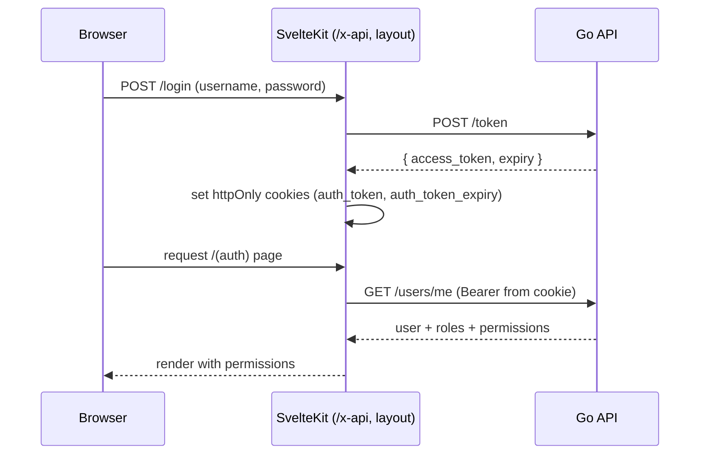

# Authentication & Access Control — Technical Documentation

> Audience: human developers and AI assistants.
> Scope: login/session (JWT), account self-service, users, roles, and the permission-based ACL.
> Cross-cutting concerns are defined in [README.md](README.md); this doc states feature-specific detail.

---

# Overview

## Purpose
- Authenticate users and authorize access to every other feature via a permission-based RBAC model.

## Responsibilities
- Issue and refresh HS256 JWTs.
- Manage users (CRUD, role/vendo assignment, password) and roles (CRUD, permissions).
- Resolve a user's effective permissions and assigned vendos for downstream ACL checks.

## Scope
- **In scope:** `/token`, `/token/refresh`, `/users*`, `/roles*`, `/users/me*`, the auth + permission middleware, and the `users`/`roles`/`account` PWA pages.
- **Out of scope:** per-feature authorization rules (documented in each feature's doc).

---

# Architecture

## How it fits into the system
- The **first gate** for all protected functionality. Every other feature depends on its middleware.

## Upstream dependencies
- `UserRepository` (auth, lookups, password, role/vendo assignment).
- `RoleRepository` (role CRUD, usage count).
- `JWT_SECRET` config.

## Downstream consumers
- **All** controllers (via `middleware.Auth` injecting `CurrentUser`).
- `RequirePermission` middleware and `assignedVendoIDs`/`canAccessVendo` helpers.
- PWA nav ACL (`getVisibleNavItems`) and per-page `+page.server.ts` guards.

---

# Data Flow

## Inputs
| Input | Endpoint | Shape |
|---|---|---|
| Credentials | `POST /token` | form: `username`, `password` |
| Bearer token | all protected routes | `Authorization: Bearer <JWT>` |
| User create/update | `POST/PUT /users` | JSON: `username`, `password?`, `is_active?`, `role_ids?`, `vendo_ids?` |
| Role create/update | `POST/PUT /roles` | JSON: `name`, `permissions[]` |
| Password change | `PUT /users/me/password` | JSON: `current_password`, `new_password` |

## Processing steps
- **Login:** verify username+password (bcrypt) → issue JWT with `exp = now + 1h` → return `{ access_token, expiry }`.
- **Auth middleware:** parse Bearer, enforce HS256, validate expiry, load `User` (with roles + vendos) into context as `CurrentUser`.
- **Refresh:** re-issue a fresh JWT for the current user; PWA layout calls it proactively when < 5 min to expiry.
- **Permission resolution:** `User.HasPermission(p)` = `p` in any role's permissions, OR `p` is an always-on default (`dashboard`, `account`).

## Outputs
- JWT + expiry (login/refresh).
- User/role JSON (passwords and role permission-blobs are never serialized raw; `password` is `json:"-"`).
- `permissions: string[]` surfaced to the PWA via `/users/me` → layout.

---

# Business Rules

## Validation rules
- Login failure (bad username or password) → 400 `Incorrect username or password`.
- Create user: `username` unique; duplicate/invalid → 422.
- Create role: `name` unique; duplicate/invalid → 422.
- Password change: both fields required (400); wrong current password → 422.

## Constraints
- A user **cannot delete their own account** → 422.
- A role **cannot be deleted while assigned to any user** → 422.
- JWT algorithm must be HS256; other algorithms are rejected (401).
- `JWT_SECRET` must not be the placeholder in production (fatal at startup).

## Assumptions
- Passwords are bcrypt-hashed at rest.
- Token expiry is ~1 hour; the PWA refreshes proactively, so users rarely hit hard expiry.
- Role permissions are stored as a JSON/text blob on the `roles` row and exposed as `permissions[]`.

## Invariants
- `CurrentUser` is always present in context for any handler behind `middleware.Auth`.
- Effective permissions always include `dashboard` and `account`.
- `password` is never returned in any response.

---

# Dependencies

## Internal modules
| Module | Role |
|---|---|
| `internal/middleware/auth.go` | Bearer parse, HS256 validation, `CurrentUser` injection. |
| `internal/middleware/permission.go` | `RequirePermission(perm)` → 403 if missing. |
| `internal/controllers/auth_controller.go` | `Login`, `Refresh`. |
| `internal/controllers/user_controller.go` | `Me`, `List`, `Get`, `Create`, `Update`, `Delete`, `ChangePassword`. |
| `internal/controllers/role_controller.go` | `List`, `Get`, `Create`, `Update`, `Delete`. |
| `internal/models/permission.go` | Permission constants, `AllPermissions()`, defaults. |
| `internal/controllers/helpers.go` | `assignedVendoIDs`, `canAccessVendo`. |

## External services
- None (no external IdP; local credential store).

## Database tables
| Table | Purpose |
|---|---|
| `users` | `id`, `username` (unique), `password` (bcrypt, hidden), `is_active`. |
| `roles` | `id`, `name` (unique), `permissions` (text/JSON). |
| `user_roles` | many-to-many users↔roles. |
| `user_vendos` | many-to-many users↔vendos (assigned vendos). |

## Configuration
- `JWT_SECRET` (required). Token TTL is fixed at ~1h in code.

---

# API / Interface

## Endpoints
| Method | Path | Handler | Access | Notes |
|---|---|---|---|---|
| POST | `/token` | `Login` | public | form-encoded creds → JWT. |
| POST | `/token/refresh` | `Refresh` | authed | re-issue JWT. |
| GET | `/users/me` | `Me` | authed | current user + roles + permissions. |
| PUT | `/users/me/password` | `ChangePassword` | authed | self password change. |
| GET | `/users` | `List` | `users` | `{ items, total }`. |
| GET | `/users/:id` | `Get` | `users` | |
| POST | `/users` | `Create` | `users` | 201. |
| PUT | `/users/:id` | `Update` | `users` | |
| DELETE | `/users/:id` | `Delete` | `users` | 422 on self-delete. |
| GET | `/roles` | `List` | `users` | `{ data }`. |
| GET | `/roles/:id` | `Get` | `users` | |
| POST | `/roles` | `Create` | `users` | 201. |
| PUT | `/roles/:id` | `Update` | `users` | |
| DELETE | `/roles/:id` | `Delete` | `users` | 422 if role in use. |

## Parameters
- `:id` = user/role ID (uint).
- Login body: `application/x-www-form-urlencoded` (`username`, `password`).

## Return values
- Login/refresh: `{ access_token: string, expiry: number }`.
- Users: single object or `{ items, total }`.
- Roles: single object or `{ data: Role[] }`.

## Error cases
| Status | Cause |
|---|---|
| 400 | Bad credentials; missing password fields. |
| 401 | Missing/invalid/expired token; non-HS256. |
| 403 | Missing `users` permission for admin endpoints. |
| 404 | User/role not found. |
| 422 | Duplicate username/role; wrong current password; self-delete; delete role in use. |
| 500 | DB error. |

---

# Security

## Authentication
- HS256 JWT, ~1h expiry, signed with `JWT_SECRET`. Algorithm pinned (non-HMAC rejected).
- PWA: JWT in httpOnly, `sameSite=strict`, `secure` (prod) cookie; never in client JS.

## Authorization
- Admin endpoints gated by `RequirePermission(models.PermUsers)` (`users`).
- `users` permission is effectively the "admin" capability and also unlocks unrestricted vendo access (`assignedVendoIDs == nil`).

## Sensitive data handling
- Passwords bcrypt-hashed; `password` field is `json:"-"`.
- Role permission blob is not serialized raw; only the derived `permissions[]` is exposed.
- Device `api_key` is unrelated here but follows the same hidden-field pattern in the vendo model.

---

# Performance

## Caching
- None server-side. The PWA caches `user`/`permissions` per request via the layout load.

## Concurrency
- Stateless JWT validation; no server session store. Horizontal scaling is straightforward (shared `JWT_SECRET`).

## Scalability considerations
- `CurrentUser` is loaded once per request with roles + vendos preloaded; permission/vendo checks then need no extra queries.

---

# Failure Modes

## Expected failures
- Expired token → 401; PWA layout redirects to `/login`.
- Forbidden (missing permission) → 403.

## Recovery strategy
- Proactive refresh (< 5 min to expiry) in `(auth)/+layout.server.ts`; on refresh failure, clear cookies and redirect to login.

## Logging and monitoring
- Errors returned as `{ detail }`. Request logging enabled in non-production only.
- No auth-specific audit log (see [Future Considerations](#future-considerations)).

---

# Related Components
- [vendo-machines.md](vendo-machines.md) and all feature docs — consume the ACL helpers.
- [README.md](README.md) — cross-cutting auth/ACL summary.

---

# Future Considerations

## Known limitations
- No refresh-token rotation or revocation list; a leaked JWT is valid until expiry.
- No audit trail for privileged actions (user/role changes).
- Always-on `dashboard`/`account` cannot be revoked per user.

## Technical debt
- Token TTL is hardcoded; consider config.

## Planned improvements
- Audit logging for user/role mutations.
- Optional MFA / external IdP integration.
