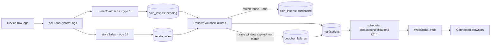

# Coin-Insert Voucher-Failure Detection — Technical Documentation

> Audience: human developers and AI assistants.
> Scope: detecting "coin inserted but no voucher generated" hardware/firmware faults on vendo machines, and notifying assigned users.
> Cross-cutting concerns (cron scheduling, WebSocket hub, sales notifications) are in [monitoring-and-notifications.md](monitoring-and-notifications.md); raw log ingestion/parsing is in [system-logs.md](system-logs.md).

---

# Overview

## Purpose
- Detect vendo machines where a customer inserted a coin but the device never produced a voucher — typically a hardware jam or firmware fault — and notify the users assigned to that vendo.

## Responsibilities
- Persist type-18 ("Inserted coin") raw device log entries as durable `coin_inserts` rows that survive across 5-minute polls.
- Match pending inserts against later sales (`vendo_sales`) to rule out false positives.
- After a grace period with no matching sale, flag the group as a `voucher_failures` instance exactly once and queue notification(s).

## Scope
- **In scope:** `coin_inserts` / `voucher_failures` tables, `internal/services/voucher_failures.go`, the `StoreCoinInserts`/`ResolveVoucherFailures` hooks inside `JuanfiLogger.RunWithProgress`.
- **Out of scope:** sale/log parsing itself (see [system-logs.md](system-logs.md)); the cron scheduler and WebSocket hub mechanics, and the sales-purchase notification (see [monitoring-and-notifications.md](monitoring-and-notifications.md)) — this feature reuses both unchanged.

---

# Architecture

## How it fits into the system
This feature adds two extra steps inside the existing `JuanfiLogger.RunWithProgress` pipeline, which already runs on the `*/5 * * * *` scheduler cron (`RefreshVendos` → `RefreshVendoLogs`) and on demand via `POST /log/refresh` (which instead calls the plain synchronous `JuanfiLogger.Run()` per active vendo — same underlying steps, no progress broadcast).



## Upstream dependencies
- `JuanfiLogger.RunWithProgress` (`internal/services/juanfi_logger.go`) — calls `StoreCoinInserts` then `ResolveVoucherFailures` after `storeSales`/`storeLogs`.
- `JuanfiAPI.ComputeLogTime` — resolves each raw log's absolute timestamp.
- `notifications` table and the existing `broadcastNotifications` @1m cron / WebSocket hub (unchanged; see [monitoring-and-notifications.md](monitoring-and-notifications.md)).

## Downstream consumers
- PWA `/notifications` page and the live `Notifications.svelte` WS listener — no changes were needed there; this feature just adds new rows to the same `notifications` table and reuses the same broadcast path.

---

# Data Flow

## Inputs
| Input | Source | Trigger |
|---|---|---|
| Raw log entries, type-18 `"Inserted coin"` (`LogParams[0]`=MAC, `LogParams[1]`=amount) | Device via `LoadSystemLogs` | `*/5 * * * *` cron or `POST /log/refresh` |
| `vendo_sales` rows (type-14 purchases) | Same poll, via `storeSales` | Same trigger |

## Processing steps
1. **`StoreCoinInserts`** — for each type-18 entry, resolves absolute time via `ComputeLogTime`; skips entries older than `coinInsertMaxAge` (2h); skips if a `coin_inserts` row for the same `vendo_id`+`mac_address`+`amount` already exists within `insert_time ± coinInsertDedupWindow` (10s), **regardless of status** (so a re-fetched raw log can never resurrect an already-purchased/failed row); otherwise inserts a new row with `status = pending`.
2. **`ResolveVoucherFailures`** (runs once per vendo, after logs+sales are stored for that poll):
   - Loads all `pending` rows for the vendo, ordered by `mac_address, insert_time`.
   - Computes the latest `vendo_sales.sale_time` per MAC (aggregated in Go, since SQLite returns `MAX(datetime)` as a string GORM can't scan into `time.Time`).
   - **Phase A (purchase match):** any pending insert whose `insert_time` is at or before the MAC's latest sale time (with `saleMatchTolerance` = 5s of backward drift allowed) is marked `purchased`. This lets one purchase resolve multiple prior coin inserts for the same MAC.
   - **Phase B (failure flagging):** remaining pending inserts are grouped by `mac_address`. A group is skipped (left pending, retried next poll) if its most recent insert is still within `failureGraceWindow` (10 minutes) of now. Once the last insert in a group is older than the grace window, the group is flagged in a single DB transaction:
     - Insert a `voucher_failures` row (`vendo_id`, `mac_address`, `first_insert_at`, `last_insert_at`, `coin_total` = sum of amounts in the group).
     - Mark all inserts in the group `failed`.
     - Build a message: `"<vendo.Name>: <mac> inserted coins totaling <total> at <last_insert_at in PHT, "Jan 2, 3:04 PM"> but no voucher was generated"`.
     - Fan out notifications (see below).
   - If the `voucher_failures` insert violates the unique index (`gorm.ErrDuplicatedKey`), the transaction is treated as already-handled by a concurrent/prior run and skipped silently — no error surfaced.

## Outputs
| Output | Destination | Shape |
|---|---|---|
| Pending/purchased/failed rows | `coin_inserts` | one row per raw coin-insert log entry |
| One row per flagged instance | `voucher_failures` | unique per `(vendo_id, mac_address, last_insert_at)` |
| Notification(s) | `notifications` | one per user assigned to the vendo, or one global (`user_id = NULL`) if none assigned |
| Broadcast frame | WebSocket clients | `{ type: "notification", id, message, user_id, created_at }` (same shape as the existing sales notification; see [monitoring-and-notifications.md](monitoring-and-notifications.md)) |

---

# Business Rules

## Invariants / tuning constants
All defined in `server/internal/services/voucher_failures.go`:

| Constant | Value | Rationale |
|---|---|---|
| `coinInsertDedupWindow` | 10s | Overlapping 5-minute polls can re-deliver the same type-18 entry; a match within ±10s on `(vendo_id, mac_address, amount, insert_time)` across **any** status is treated as the same physical event (mirrors `storeSales`'s dedup approach). |
| `coinInsertMaxAge` | 2h | Ignores stale log-buffer replays so a first deploy (or a logger that hasn't run in a while) never floods notifications for old, already-resolved-in-reality inserts. |
| `failureGraceWindow` | 10 minutes | Time to wait after the last coin insert in a group before flagging it — long enough that a purchase whose sale log only lands on the *next* 5-minute poll is still given a chance to resolve the group. |
| `saleMatchTolerance` | 5s | Absorbs `sale_time`/`insert_time` drift caused by `ComputeLogTime` being recomputed each poll (device uptime-based clock); a sale up to 5s "before" the insert still counts as a match. |

## Notify-once guarantee
Two layers combine so a given real-world failure event produces exactly one notification set, even across concurrent/re-run polls:
1. `coin_inserts` dedup window prevents the same raw coin-insert log line from creating duplicate pending rows.
2. The unique index on `voucher_failures(vendo_id, mac_address, last_insert_at)` is the durable notify-once boundary — `last_insert_at` is a stored, poll-stable value (fixed at ingestion), so a retried `ResolveVoucherFailures` run for the same group after the row already exists will hit the unique constraint and no-op instead of creating a second notification.

## Fan-out rule
- Notifications are sent to every `user_id` found in `user_vendos` for the vendo (one `Notification` row per user, each with that `user_id`).
- If no users are assigned to the vendo, a single **global** notification (`user_id = NULL`) is created instead — matching the frontend's existing "global vs per-user" filtering convention.

---

# Dependencies

## Internal modules
| Module | Role |
|---|---|
| `internal/services/voucher_failures.go` | `StoreCoinInserts`, `ResolveVoucherFailures` |
| `internal/services/juanfi_logger.go` | `RunWithProgress` — invokes both functions after `storeSales`/`storeLogs` |
| `internal/models/coin_insert.go` | `CoinInsert` model + status constants |
| `internal/models/voucher_failure.go` | `VoucherFailure` model |
| `internal/models/notification.go` | shared `Notification` model (reused, unchanged) |
| `internal/repository/notification_repository.go` | `Search`, `PullUnread` (reused, unchanged) |
| `internal/scheduler/scheduler.go` | `broadcastNotifications`, `RefreshVendos`/`RefreshVendoLogs` (reused, unchanged) |

## Database tables
**`coin_inserts`** (`internal/models/coin_insert.go`):
| Column | Type | Notes |
|---|---|---|
| `id` | uint, PK | |
| `vendo_id` | uint | indexed (`idx_coin_insert_lookup`, composite with mac_address/status) |
| `mac_address` | string | indexed |
| `amount` | float64 | |
| `insert_time` | time.Time | resolved via `ComputeLogTime` |
| `status` | string | `pending` \| `purchased` \| `failed`; indexed |
| `created_at` | time.Time | |

**`voucher_failures`** (`internal/models/voucher_failure.go`):
| Column | Type | Notes |
|---|---|---|
| `id` | uint, PK | |
| `vendo_id` | uint | part of unique index `idx_voucher_failure_instance` |
| `mac_address` | string | part of unique index |
| `last_insert_at` | time.Time | part of unique index — the notify-once key |
| `first_insert_at` | time.Time | |
| `coin_total` | float64 | sum of grouped insert amounts |
| `created_at` | time.Time | |

Both models avoid GORM association struct fields (e.g. no `Vendo *Vendo`) per the project's SQLite-migration gotcha — `vendo_id` is a plain scalar column.

## Configuration
- None specific to this feature; reuses the existing cron schedule and no new env vars.

---

# API / Interface

## GET /notifications
Unchanged endpoint, now also returns coin-failure notifications alongside sale/other notifications (same table, no schema/route change).

- **Auth:** Bearer JWT required.
- **Authorization:** admins (checked via `authz.IsAdmin` — has the `users` permission) see all notifications; everyone else sees global (`user_id IS NULL`) plus their own (`user_id = <self>`).
- **Query params:** `page`, `size` (pagination).
- **Response shape:** `PageResult[models.Notification]` — `{ items, total, page, size, pages }`.

Example item produced by this feature:
```json
{
  "id": 42,
  "message": "Vendo 3: F1:00:00:00:00:01 inserted coins totaling 15.00 at Jul 3, 2:14 PM but no voucher was generated",
  "user_id": 7,
  "read_at": "2026-07-03T06:15:00Z",
  "created_at": "2026-07-03T06:14:10Z",
  "updated_at": null
}
```

## WebSocket broadcast
No new endpoint — reuses `/ws` and the existing `broadcastNotifications` @1m cron, which pulls unread rows (`PullUnread`, marking `read_at`) and sends each as:
```json
{ "type": "notification", "id": 42, "message": "...", "user_id": 7, "created_at": "..." }
```
No distinct `type` discriminator exists for coin-failure vs. sale notifications — both use `"type": "notification"`; clients distinguish them only by message content, if at all.

---

# Frontend

- Route: `/notifications` (`client-pwa/src/routes/(auth)/notifications/+page.svelte`) — renders `NotificationTable.svelte`, which drives a generic `DataTable` against `/x-api/notifications` (columns: `Time` / `created_at`, `Message`). No feature-specific frontend code was added — coin-failure rows appear identically to any other notification.
- Live refresh: `NotificationTable.svelte` subscribes to the `incomingNotification` store (`client-pwa/src/lib/store/notifications.ts`) and calls `dataTable.refresh()` whenever a new WS frame arrives.
- WS filtering (`client-pwa/src/lib/components/Notifications.svelte`): a frame is dropped only when `currentUserId !== null && notification.user_id != null && notification.user_id !== currentUserId`. A `user_id = null` (global) frame is never dropped; `currentUserId === null` (admin) bypasses filtering entirely and receives every notification, including per-user ones for vendos they may not be assigned to.
- `currentUserId` wiring (`client-pwa/src/routes/(auth)/+layout.svelte`): `data.permissions.includes('users') ? null : (data.user?.id ?? null)` — i.e. admin-ness for WS filtering purposes is "has the `users` permission," matching the model above, not a dedicated role flag.
- Nav entry: `client-pwa/src/lib/nav.ts` — `{ href: '/notifications', icon: 'bell', label: 'Notifications' }` has **no `requiredPermission`**, so it is shown to every authenticated user regardless of ACL. This is existing, intentional-as-is behavior (unchanged by this feature) — flagged here since coin-failure notifications now flow through the same ungated page.

---

# Failure Modes

## Expected failures
- **Device offline / log fetch fails:** `LoadSystemLogs` errors out before `StoreCoinInserts`/`ResolveVoucherFailures` run for that vendo that poll; no new `coin_inserts` rows, and no false failures are raised since there's nothing new to resolve. Already-pending groups simply wait until the next successful poll.
- **Device log buffer rotation:** the device only exposes a rolling log buffer. If a type-18 "Inserted coin" entry rotates out before any poll ingests it (e.g. a burst of activity between two 5-minute polls), the failure can be silently missed — a false negative with no compensating control today.
- **Scheduler downtime:** if the `*/5 * * * *` cron doesn't run for an extended period, both ingestion and resolution stall; on resumption, `coinInsertMaxAge` (2h) may cause very old pending inserts to still be ingested-then-resolved (if within 2h) or silently dropped (if the underlying raw log entry itself is older than 2h at ingestion time).
- **Concurrent resolve runs** (e.g. manual `POST /log/refresh` overlapping with the cron): handled by the `voucher_failures` unique index — the losing transaction gets `gorm.ErrDuplicatedKey` and is skipped, not treated as an error.

## Recovery strategy
- Fully self-healing: both `StoreCoinInserts` and `ResolveVoucherFailures` are safe to re-run every poll; groups still pending simply get re-evaluated.

## Logging and monitoring
- Per-error logging via `log.Printf` (`"store coin insert: ..."`, `"voucher failure [%s/%s]: ..."`) — no metrics or alerting beyond the notification itself.

---

# Related Components
- [monitoring-and-notifications.md](monitoring-and-notifications.md) — scheduler, WebSocket hub, and the shared `notifications` table/broadcast mechanism this feature reuses.
- [system-logs.md](system-logs.md) — raw log fetching/parsing (`LoadSystemLogs`, `ComputeLogTime`, `RawLog`) that both sales and coin-insert detection consume.

---

# Future Considerations

## Known limitations
- Detection is purely presence/absence of a matching sale after a coin insert — there is no amount-reconciliation (e.g. comparing total inserted vs. total purchased per MAC over a session); a partial/short-changed voucher would not be caught.
- Log type-17 ("`Create voucher failed {0}, retrying...`") is a more direct device-reported failure signal but is not currently parsed or used anywhere — `ResolveVoucherFailures` only infers failure from the *absence* of a sale after the grace window.
- `Notification.ReadAt` exists at the model level but is only used as the pull-and-broadcast marker (`PullUnread`) for the @1m cron — there is no per-user read/unread tracking in the `GET /notifications` history view.
- The buffer-rotation false-negative (see Failure Modes) has no mitigation; a device with very high coin-insert throughput between polls could lose events before they're ever stored.

## Planned improvements
- None specified in code/tests at this time.
