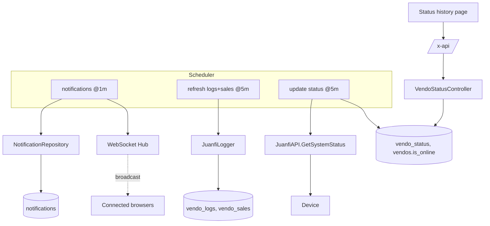

# Monitoring, Scheduler & Notifications — Technical Documentation

> Audience: human developers and AI assistants.
> Scope: the cron scheduler, persisted status snapshots/history, and real-time notifications over WebSocket.
> Cross-cutting concerns (auth, ACL, device API, error shape) are in [README.md](README.md).

---

# Overview

## Purpose
- Keep VendoReport's data fresh without user action, and push real-time notifications to connected clients.

## Responsibilities
- Run three recurring cron jobs (notifications @1m, logs+sales @5m, status @5m).
- Persist periodic device status snapshots and keep `is_online` accurate.
- Serve aggregated status history for charts.
- Broadcast unread notifications to WebSocket clients.

## Scope
- **In scope:** `internal/scheduler`, `vendo_status` history endpoint, `internal/websocket`, `notifications` table.
- **Out of scope:** the per-device live status endpoint (see [vendo-machines.md](vendo-machines.md)); log/sales parsing (see [system-logs.md](system-logs.md)).

---

# Architecture

## How it fits into the system
- A background subsystem started at boot (`scheduler.Start`) and stopped on shutdown. It writes to the same DB the API reads.

## Upstream dependencies
- `robfig/cron/v3`, `gorilla/websocket`.
- `JuanfiAPI`, `JuanfiLogger`, repositories.

## Downstream consumers
- PWA dashboard/status-history charts; PWA notification listener (`/ws`).

---

# Data Flow

## Inputs
| Input | Source | Trigger |
|---|---|---|
| Cron ticks | `robfig/cron` | `* * * * *` and `*/5 * * * *` |
| Device status | Device | each @5m status job |
| Unread notifications | `notifications` table | each @1m job |
| Status history query | `GET /vendo-status-history` | PWA |

## Processing steps
- **Notifications @1m:** `PullUnread()` → for each, broadcast JSON `{"type":"notification","id":...,"message":...,"user_id":...,"created_at":...}` to the hub. Notification rows are queued not just for new sales but also for coin-insert voucher-failure detection — see [coin-failure-notifications.md](coin-failure-notifications.md).
- **Logs+sales @5m:** iterate active vendos → `JuanfiLogger.Run()` (see [system-logs.md](system-logs.md)); this same run also persists coin-insert events and resolves voucher failures ([coin-failure-notifications.md](coin-failure-notifications.md)).
- **Status @5m:** iterate active vendos → `GetSystemStatus()`; on failure set `is_online=false`; on success record a `vendo_status` snapshot **only when metrics changed** and keep `is_online` in sync.
- **History read:** `GET /vendo-status-history` → aggregated hourly rows, row-scoped.

## Outputs
| Output | Destination | Shape |
|---|---|---|
| Snapshot rows | `vendo_status` | metrics per timestamp. |
| `is_online` | `vendos` | boolean kept current. |
| Notification frames | WebSocket clients | `{ type, message }` JSON. |
| History | PWA | `{ data: HourlyStatusRow[] }`. |

---

# Business Rules

## Validation rules
- History query: optional `vendo_id`, `from`/`to`, `active_only`; row-scoped to assigned vendos.

## Constraints
- Jobs run **only against `is_active` vendos**.
- A status snapshot is written **only when metrics differ** from the last (change-detection), avoiding redundant rows.
- Each cron job is wrapped in `safeRun` so a panic/error in one job does not crash the scheduler or other jobs.

## Assumptions
- The scheduler is started in the server process (`startScheduler=true`); tests pass `false`.
- WebSocket `/ws` is a **broadcast** channel (no per-user routing, no auth) — clients receive all notifications.
- Notification "unread" state is consumed by the @1m job (pull semantics).

## Invariants
- `is_online` reflects the most recent reachability result from the status job.
- A device that is unreachable during a status tick is marked offline, not silently skipped.

---

# Dependencies

## Internal modules
| Module | Role |
|---|---|
| `internal/scheduler/scheduler.go` | `Start`, `broadcastNotifications`, `RefreshVendoLogs`, `UpdateVendoStatus`, `safeRun`. |
| `internal/websocket/hub.go` / `handler.go` | Hub, `Broadcast`, `RegisterAndServe`, `Handler`. |
| `internal/controllers/vendo_status_controller.go` | `Search` (history). |
| `internal/repository/vendo_status_repository.go` | `GetHourlyStatus`. |
| `internal/repository/notification_repository.go` | `PullUnread`, `Add`. |
| `internal/services/juanfi_api.go` | `GetSystemStatus`. |

## External services
- Juanfi device API `api/dashboard` (status).

## Database tables
| Table | Columns (relevant) |
|---|---|
| `vendo_status` | `id`, `vendo_id`, `total_sales?`, `current_sales?`, `customer_count?`, `free_heap?`, `wireless_strength?`, `active_users?`, `created_at`. |
| `notifications` | `id`, `message`, `user_id?`, `read_at?`, `created_at`. |
| `vendos` | `is_online` (kept in sync by the status job). |

## Configuration
- `VITE_WS_URL` (PWA client) for the WebSocket connection. No server env for cron schedules (hardcoded).

---

# API / Interface

## Endpoints & channels
| Type | Path | Handler | Access | Returns |
|---|---|---|---|---|
| GET | `/vendo-status-history` | `Search` | authed (row-scoped) | `{ data: HourlyStatusRow[] }` |
| WS | `/ws` | `ws.Handler` | **public** | stream of `{ type, message }` |

## Cron jobs (internal interface)
| Schedule | Function | Effect |
|---|---|---|
| `* * * * *` | `broadcastNotifications` | push unread notifications. |
| `*/5 * * * *` | `RefreshVendoLogs` | ingest logs + sales. |
| `*/5 * * * *` | `UpdateVendoStatus` | snapshot status, sync `is_online`. |

- Exported job functions are also runnable via CLI for manual invocation.

## Error cases
| Status | Cause |
|---|---|
| 401 | Missing/invalid token (history endpoint). |
| 500 | DB error (history endpoint). |
| — | Cron job errors are caught by `safeRun` and logged, not surfaced as HTTP. |

---

# Security

## Authentication
- History endpoint requires Bearer JWT. **`/ws` is unauthenticated.**

## Authorization
- History is row-scoped. WebSocket has no authorization — it broadcasts to all clients.

## Sensitive data handling
- Notification messages should not contain secrets, since `/ws` is unauthenticated and broadcast to all clients (current assumption: messages are non-sensitive operational alerts).

---

# Performance

## Caching
- None. Change-detection on status writes minimizes row growth instead.

## Concurrency
- The hub fans out to all clients; jobs run on cron goroutines. `safeRun` isolates failures.
- Status/log jobs call devices sequentially with 5s timeouts.

## Scalability considerations
- @5m jobs scale linearly with active vendo count and device latency; a very large fleet may exceed the 5-minute window.
- WebSocket fan-out scales with connected client count.

---

# Failure Modes

## Expected failures
- Device unreachable during status tick → `is_online=false`, no snapshot.
- One job panicking → contained by `safeRun`; other jobs and the scheduler continue.

## Recovery strategy
- Jobs are idempotent and self-healing on the next tick.
- On shutdown, `StopScheduler` stops the cron cleanly.

## Logging and monitoring
- Per-job/per-vendo errors logged to stdout (`scheduler: ...`). No metrics emitted.

---

# Related Components
- [system-logs.md](system-logs.md) — shares the log/sales ingestion path.
- [vendo-machines.md](vendo-machines.md) — live status counterpart and `is_online` consumer.
- [coin-failure-notifications.md](coin-failure-notifications.md) — coin-inserted-but-no-voucher detection, another producer of `notifications` rows broadcast through this same pipeline.

---

# Future Considerations

## Known limitations
- `/ws` lacks authentication and per-user targeting.
- Cron schedules are hardcoded; not configurable per environment.
- No observability metrics for job duration/success.

## Technical debt
- Sequential device polling may not finish within the interval for large fleets.

## Planned improvements
- Authenticated, user-targeted WebSocket; configurable schedules; concurrent (bounded) device polling; job metrics.
