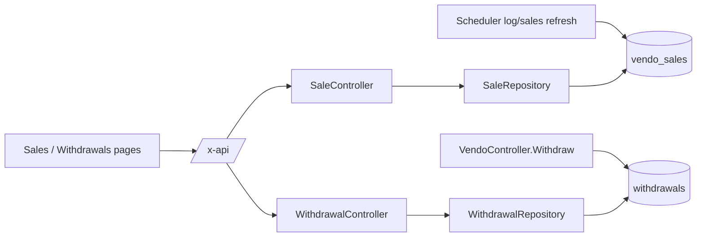

# Sales & Withdrawals — Technical Documentation

> Audience: human developers and AI assistants.
> Scope: voucher sale records, daily/monthly sales aggregates, and the withdrawal log.
> Cross-cutting concerns (auth, ACL, pagination, error shape) are in [README.md](README.md).

---

# Overview

## Purpose
- Provide searchable sales history and aggregated revenue reporting, plus a read view of withdrawals.

## Responsibilities
- Serve paginated, filterable voucher sale records.
- Compute daily and monthly sales totals per vendo over a date range.
- List withdrawal records (the write path lives in [vendo-machines.md](vendo-machines.md)).

## Scope
- **In scope:** `/sales`, `/daily-sales`, `/monthly-sales`, `/withdrawals` (read).
- **Out of scope:** ingesting sales (done by the scheduler's log/sales refresh — see [system-logs.md](system-logs.md) / [monitoring-and-notifications.md](monitoring-and-notifications.md)); creating withdrawals (see [vendo-machines.md](vendo-machines.md)).

---

# Architecture

## How it fits into the system
- Read-only reporting over `vendo_sales` and `withdrawals`, both populated elsewhere.

## Upstream dependencies
- `SaleRepository`, `WithdrawalRepository`.
- ACL helper `assignedVendoIDs`.

## Downstream consumers
- PWA: `SaleTable.svelte`, dashboard charts (daily/monthly), `WithdrawalTable.svelte`.

---

# Data Flow

## Inputs
| Input | Endpoint | Params |
|---|---|---|
| Sales search | `GET /sales` | `q?`, `date?`, `vendo_id?`, `sort_by?`, `sort_dir?`, `page?`, `size?` |
| Daily sales | `GET /daily-sales` | date range (`from`/`to` via `parseDateRange`) |
| Monthly sales | `GET /monthly-sales` | date range |
| Withdrawals | `GET /withdrawals` | `vendo_id?` |

## Processing steps
- **Sales search:** build optional `q`/`date`/`vendo_id` pointers → call repo with `assignedVendoIDs(c)` row-scoping → return `PageResult`.
- **Daily/Monthly:** parse date range → aggregate per vendo → return rows.
- **Withdrawals:** optional `vendo_id` filter → row-scoped list.

## Outputs
| Output | Shape |
|---|---|
| Sales | `PageResult<VendoSale>` = `{ items, total, page, size, pages }`. |
| Daily | `{ data: DailySaleRow[] }` (`date`, `total`, `vendo_id`, `vendo_name`). |
| Monthly | `{ data: MonthlySaleRow[] }` (`month`, `total`, `vendo_id`, `vendo_name`). |
| Withdrawals | `{ data: Withdrawal[] }`. |

---

# Business Rules

## Validation rules
- `vendo_id` must parse as uint when provided; invalid `vendo_id` on `/withdrawals` → 400. Invalid `vendo_id` on `/sales` is ignored (treated as unset).
- Empty `q`/`date` are treated as "no filter" (nil pointers).

## Constraints
- All four endpoints apply **row-level scoping**: non-admins see only their assigned vendos.
- Pagination defaults via `paginationParams` (page 1, default size).

## Assumptions
- `vendo_sales` rows are deduplicated on `(vendo_id, sale_time)` (unique index `idx_vendo_sale_time`) during ingestion.
- Sale `amount` is the voucher price; aggregates are simple sums.
- Date filters are interpreted by the repository (string `date` for search; `from`/`to` range for aggregates).

## Invariants
- A sale row has a non-null `vendo_id`, `sale_time`, `voucher`, and `amount`.
- Aggregate rows always carry `vendo_id` + `vendo_name` for grouping/labeling.

---

# Dependencies

## Internal modules
| Module | Role |
|---|---|
| `internal/controllers/sale_controller.go` | `Search`, `DailySales`, `MonthlySales`, `parseDateRange`. |
| `internal/controllers/withdrawal_controller.go` | `Search`. |
| `internal/repository/sale_repository.go` | `Search`, `GetDailySales`, `GetMonthlySales`. |
| `internal/repository/withdrawal_repository.go` | `Search`, `Add`. |

## External services
- None (reporting is DB-only).

## Database tables
| Table | Columns (relevant) |
|---|---|
| `vendo_sales` | `id`, `vendo_id`, `sale_time`, `mac_address`, `voucher`, `amount`; unique `(vendo_id, sale_time)`. |
| `withdrawals` | `id`, `vendo_id`, `user_id?`, `amount`, `created_at`. |

## Configuration
- None feature-specific.

---

# API / Interface

## Endpoints
| Method | Path | Handler | Access | Returns |
|---|---|---|---|---|
| GET | `/sales` | `Search` | authed (row-scoped) | `PageResult<VendoSale>` |
| GET | `/daily-sales` | `DailySales` | authed (row-scoped) | `{ data: DailySaleRow[] }` |
| GET | `/monthly-sales` | `MonthlySales` | authed (row-scoped) | `{ data: MonthlySaleRow[] }` |
| GET | `/withdrawals` | `Search` | authed (row-scoped) | `{ data: Withdrawal[] }` |

## Parameters
- See [Inputs](#inputs). All filters optional except where noted.

## Error cases
| Status | Cause |
|---|---|
| 400 | Invalid `vendo_id` on `/withdrawals`. |
| 401 | Missing/invalid token. |
| 500 | DB error. |

> Assumption: PWA nav gates Sales on the `sales` permission and Withdrawals on the `withdrawals` permission; the API endpoints enforce auth + row-scoping.

---

# Security

## Authentication
- Bearer JWT required.

## Authorization
- Row-level scoping via `assignedVendoIDs(c)`; admins unrestricted.

## Sensitive data handling
- `mac_address` is device-side client identifier; treated as low-sensitivity operational data. No PII beyond MAC.

---

# Performance

## Caching
- None. Aggregates computed on demand.

## Concurrency
- Read-only; safe under concurrent access.

## Scalability considerations
- Sales search is paginated and indexed on `(vendo_id, sale_time)`.
- Aggregates scan the date range; large ranges over large fleets are the main cost — bound the range in the UI.

---

# Failure Modes

## Expected failures
- DB error → 500. Invalid withdrawal `vendo_id` → 400.

## Recovery strategy
- Pure reads; retry-safe.

## Logging and monitoring
- Errors as `{ detail }`. No feature-specific metrics.

---

# Related Components
- [vendo-machines.md](vendo-machines.md) — creates withdrawal rows and resets device sales.
- [monitoring-and-notifications.md](monitoring-and-notifications.md) / [system-logs.md](system-logs.md) — ingest `vendo_sales`.

---

# Future Considerations

## Known limitations
- Withdrawals endpoint is list-only (no pagination/date filter).
- Aggregates have no caching for repeated dashboard loads.

## Technical debt
- `/sales` silently ignores an invalid `vendo_id` while `/withdrawals` rejects it — inconsistent handling.

## Planned improvements
- Cache daily/monthly aggregates; add pagination + date range to withdrawals.
