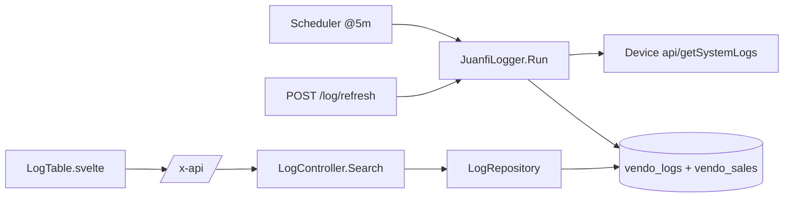

# System Logs — Technical Documentation

> Audience: human developers and AI assistants.
> Scope: persistence, search, and manual refresh of device system logs.
> Cross-cutting concerns (auth, ACL, pagination, error shape) are in [README.md](README.md).

---

# Overview

## Purpose
- Persist and expose human-readable device event logs (boot, connect, purchases, resets, etc.) for troubleshooting and audit.

## Responsibilities
- Serve paginated, filterable log records from the DB.
- Provide a manual refresh that pulls fresh logs (and sales) from active devices on demand.

## Scope
- **In scope:** `GET /logs`, `POST /log/refresh`, the `vendo_logs` table.
- **Out of scope:** scheduled log ingestion (same code path, triggered by cron — see [monitoring-and-notifications.md](monitoring-and-notifications.md)); device log parsing internals (see `juanfi_api.go`).

---

# Architecture

## How it fits into the system
- Logs are ingested from devices (scheduled or manual) and read back via search.

## Upstream dependencies
- `LogRepository` (search), `VendoRepository` (active vendos for refresh).
- `JuanfiLogger` service (`internal/services/juanfi_logger.go`).

## Downstream consumers
- PWA `LogTable.svelte` (System Logs page).

---

# Data Flow

## Inputs
| Input | Endpoint | Params |
|---|---|---|
| Log search | `GET /logs` | `q?`, `date?`, `vendo_id?`, `page?`, `size?` |
| Manual refresh | `POST /log/refresh` | none |

## Processing steps
- **Search:** build optional filter pointers → call repo with `assignedVendoIDs(c)` row-scoping → return `PageResult`.
- **Refresh:** iterate active vendos → `JuanfiLogger.Run()` per vendo → device `api/getSystemLogs` → parse, format timestamps, dedupe, persist new `vendo_logs` (and sales).

## Outputs
| Output | Shape |
|---|---|
| Logs | `PageResult<VendoLog>` = `{ items, total, page, size, pages }`. |
| Refresh result | `{ "success": true }`. |

---

# Business Rules

## Validation rules
- `vendo_id` parsed as uint when provided; empty `q`/`date` → no filter.

## Constraints
- Search is **row-level scoped** to assigned vendos for non-admins.
- Logs are deduplicated on `(vendo_id, log_time)` (unique index `idx_vendo_log_time`).

## Assumptions
- Device log timestamps are device-relative milliseconds; the logger converts them to wall-clock using the device's reported uptime (dashboard call precedes log fetch).
- Log descriptions are produced from indexed firmware templates (`FormatLogMessage`).
- Refresh affects only `is_active` vendos.

## Invariants
- A `vendo_logs` row has a non-null `vendo_id`, `log_time`, and `description`.
- Re-running refresh does not create duplicate rows for the same `(vendo_id, log_time)`.

---

# Dependencies

## Internal modules
| Module | Role |
|---|---|
| `internal/controllers/log_controller.go` | `Search`, `Refresh`, `paginationParams`. |
| `internal/repository/log_repository.go` | `Search`. |
| `internal/services/juanfi_logger.go` | `Run` — fetch/parse/persist logs + sales. |
| `internal/services/juanfi_api.go` | `LoadSystemLogs`, `GetFormattedLogs`, `ComputeLogTime`, `FormatLogMessage`. |

## External services
- Juanfi device API `api/getSystemLogs` (+ `api/dashboard` for uptime).

## Database tables
| Table | Columns (relevant) |
|---|---|
| `vendo_logs` | `id`, `vendo_id`, `log_time`, `description`; unique `(vendo_id, log_time)`. |

## Configuration
- None feature-specific.

---

# API / Interface

## Endpoints
| Method | Path | Handler | Access | Returns |
|---|---|---|---|---|
| GET | `/logs` | `Search` | authed (row-scoped) | `PageResult<VendoLog>` |
| POST | `/log/refresh` | `Refresh` | authed | `{ success: true }` |

> Assumption: PWA nav gates the Logs page on the `logs` permission; the API endpoints enforce auth + row-scoping.

## Error cases
| Status | Cause |
|---|---|
| 401 | Missing/invalid token. |
| 500 | DB error, or refresh failure aggregating device pulls. |

---

# Security

## Authentication
- Bearer JWT required.

## Authorization
- Search row-scoped via `assignedVendoIDs`. Refresh available to any authenticated user (iterates active vendos server-side).

## Sensitive data handling
- Logs may contain MAC addresses and voucher identifiers (operational, low-sensitivity). No credentials are logged.

---

# Performance

## Caching
- None. Search is DB-only and paginated.

## Concurrency
- Refresh calls each active device sequentially (5s timeout each); cost scales with fleet size.

## Scalability considerations
- A manual refresh over a large fleet can be slow and overlaps with the @5m cron job; both are idempotent due to dedup.

---

# Failure Modes

## Expected failures
- A single device failing during refresh is logged and skipped; the overall call still returns success unless aggregation itself errors (500).

## Recovery strategy
- Idempotent ingestion (dedup) makes refresh safe to retry.

## Logging and monitoring
- Per-vendo failures are written to the server log (`scheduler: log refresh [name]: err`). Endpoint errors as `{ detail }`.

---

# Related Components
- [monitoring-and-notifications.md](monitoring-and-notifications.md) — the cron job that runs the same ingestion on a schedule.
- [sales-and-withdrawals.md](sales-and-withdrawals.md) — sales are ingested alongside logs.

---

# Future Considerations

## Known limitations
- Manual refresh is synchronous and unbounded in fleet size (no backgrounding/progress).
- No retention/pruning policy for `vendo_logs`.

## Technical debt
- Refresh status is coarse (`success: true`) and does not report per-vendo outcomes to the caller.

## Planned improvements
- Background the refresh with progress/results; add log retention.
