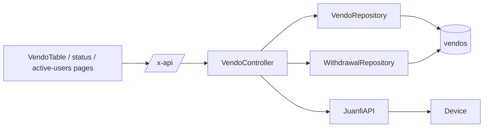

# Vendo Machines — Technical Documentation

> Audience: human developers and AI assistants.
> Scope: vendo machine records, live device status, active users, enable/disable, and current-sales withdrawal.
> Cross-cutting concerns (auth, ACL, device API, error shape) are in [README.md](README.md).

---

# Overview

## Purpose
- Register and manage the fleet of vendo machines and surface their live device state.

## Responsibilities
- CRUD for `vendos` records (name, `api_url`, `api_key`, flags).
- Fetch live status and active users directly from each device.
- Toggle a vendo's active flag; perform a current-sales withdrawal (reset coin counter + log).

## Scope
- **In scope:** `/vendo-machines*` endpoints (except `/rates*`, see [vendo-rates.md](vendo-rates.md)).
- **Out of scope:** persisted status history/snapshots (see [monitoring-and-notifications.md](monitoring-and-notifications.md)); rates.

---

# Architecture

## How it fits into the system
- Owns the `vendos` table that nearly every other feature references via `vendo_id`.
- Live endpoints call the device synchronously; persisted history is produced by the scheduler.

## Upstream dependencies
- `VendoRepository`, `WithdrawalRepository`, `UserRepository`.
- `JuanfiAPI` service (status, active users, reset current sales).
- Auth + ACL helpers.

## Downstream consumers
- Sales, Logs, Status, Withdrawals, and Rates features (reference `vendos`).
- PWA: `VendoTable.svelte`, `/vendo/[id]/status`, `/vendo/[id]/active-users`, `/vendo/[id]/withdraw`.

---

# Data Flow

## Inputs
| Input | Endpoint | Shape |
|---|---|---|
| Create vendo | `POST /vendo-machines` | JSON: `name`, `api_url`, `api_key`, … |
| Set status | `POST /vendo-machines/:id/set-status` | JSON: `is_active` (bool/int) |
| Withdraw | `POST /vendo-machines/:id/withdraw-current-sales` | none (acts on current device sales) |

## Processing steps
- **All / Get:** read from DB; list attaches `recent_status` (latest snapshot) per vendo; results are row-level scoped to assigned vendos for non-admins.
- **Status / ActiveUsers:** check access → load vendo → call device (`GetSystemStatus` / `GetActiveUsers`) → return live data.
- **Withdraw:** check access → read device current sales → reset device coin counter → record a `withdrawals` row.
- **SetStatus:** check access → update `is_active`.

## Outputs
| Output | Destination | Shape |
|---|---|---|
| Vendo list/detail | PWA | `{ data }` (with `recent_status` on list). |
| Live status | PWA | `SystemStatus` object. |
| Active users | PWA | `{ data: ActiveUser[] }`. |
| Withdrawal | DB + PWA | `withdrawals` row; `{ message }`. |

---

# Business Rules

## Validation rules
- `:id` must be a valid uint → else 400.
- Create requires a valid body; `name` is unique (DB-enforced).

## Constraints
- Non-admins may only read/act on **assigned** vendos (`canAccessVendo`) → 403 otherwise.
- Status/ActiveUsers/Withdraw require a reachable device → 502 on failure.

## Assumptions
- `api_key` authenticates to the device and is **never serialized** to clients (`json:"-"`).
- "Current sales" is the device's resettable coin counter; withdrawal is the act of resetting it and recording the amount.
- `is_active` controls whether the scheduler polls the vendo.

## Invariants
- A withdrawal row is created only after the device reset call path executes.
- List responses never include `api_key`.

---

# Dependencies

## Internal modules
| Module | Role |
|---|---|
| `internal/controllers/vendo_controller.go` | `All`, `Get`, `Store`, `Delete`, `Status`, `ActiveUsers`, `Withdraw`, `SetStatus`. |
| `internal/repository/vendo_repository.go` | `Search`, `GetByID`, `Create`, `Delete`, `SetStatus`, `AllActive`. |
| `internal/repository/withdrawal_repository.go` | `Add` (used by Withdraw). |
| `internal/services/juanfi_api.go` | `GetSystemStatus`, `GetActiveUsers`, `ResetCurrentSales`. |

## External services
- Juanfi device API (`api/dashboard`, `api/getActiveUsers`, `api/resetStatistic?type=coinCount`).

## Database tables
| Table | Notes |
|---|---|
| `vendos` | `id`, `name` (unique), `mac_address?`, `api_url?`, `api_key?` (hidden), `is_online`, `total_sales?`, `current_sales?`, `is_active`. |

## Configuration
- None feature-specific.

---

# API / Interface

## Endpoints
| Method | Path | Handler | Access |
|---|---|---|---|
| GET | `/vendo-machines` | `All` | authed (row-scoped) |
| GET | `/vendo-machines/:id` | `Get` | `canAccessVendo` |
| POST | `/vendo-machines` | `Store` | authed |
| DELETE | `/vendo-machines/:id` | `Delete` | authed |
| GET | `/vendo-machines/:id/status` | `Status` | `canAccessVendo` |
| GET | `/vendo-machines/:id/active-users` | `ActiveUsers` | `canAccessVendo` |
| POST | `/vendo-machines/:id/withdraw-current-sales` | `Withdraw` | `canAccessVendo` |
| POST | `/vendo-machines/:id/set-status` | `SetStatus` | `canAccessVendo` |

> Assumption: `vendos` requires the `vendos` permission to appear in nav; the API endpoints above are gated by auth + per-vendo access rather than a dedicated route-level permission group.

## Return values
- `{ data: Vendo | Vendo[] }`, `SystemStatus`, `{ data: ActiveUser[] }`, `{ message }`.

## Error cases
| Status | Cause |
|---|---|
| 400 | Invalid `:id` or body. |
| 403 | Vendo not assigned to user. |
| 404 | Vendo not found. |
| 500 | DB error. |
| 502 | Device unreachable / non-200. |

---

# Security

## Authentication
- Bearer JWT required on all endpoints.

## Authorization
- Per-vendo row-level access (`canAccessVendo`). Admins (`users`) are unrestricted.

## Sensitive data handling
- `api_key` is `json:"-"` — read server-side only, sent to the device as `X-TOKEN`, never to clients.

---

# Performance

## Caching
- None. List attaches the latest persisted snapshot rather than calling devices, so it is DB-only and fast.

## Concurrency
- Live status/active-users/withdraw each make one device call (5s timeout). Independent per request.

## Scalability considerations
- Live endpoints scale with device latency, not DB. List scales with vendo count (single query + snapshot join).

---

# Failure Modes

## Expected failures
- Device offline → 502 for status/active-users/withdraw.
- Unauthorized vendo → 403.

## Recovery strategy
- Live calls are read-mostly and safe to retry. Withdraw is **not idempotent** (each successful call resets and logs again) — callers should not blindly retry on ambiguous results.

## Logging and monitoring
- Errors as `{ detail }`. The scheduler separately sets `is_online=false` when a device is unreachable during status polling.

---

# Related Components
- [monitoring-and-notifications.md](monitoring-and-notifications.md) — persisted status snapshots + `is_online`.
- [sales-and-withdrawals.md](sales-and-withdrawals.md) — the withdrawal log this feature writes to.
- [vendo-rates.md](vendo-rates.md) — rate management on the same `:id` namespace.

---

# Future Considerations

## Known limitations
- No update (`PUT`) endpoint for vendo metadata in the route table; creation + delete + set-status only.
- Withdraw lacks an idempotency key.

## Technical debt
- Live status is not cached; rapid repeated views hit the device each time.

## Planned improvements
- Add a vendo update endpoint and an idempotency token for withdrawals.
