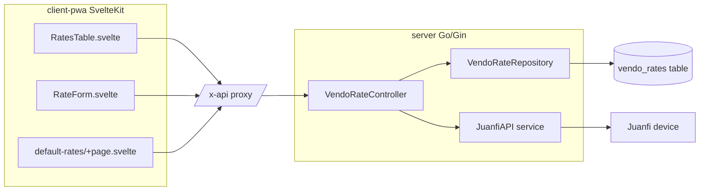

# Vendo Rates — Technical Documentation

> Audience: human developers and AI assistants.
> Scope: the **Vendo Rates** feature only (Go API + SvelteKit PWA).
> Terminology is fixed in [Glossary](#glossary); all sections use it consistently.

## Glossary

| Term | Definition |
|---|---|
| **Rate** | One pricing tier: name, price, minutes, validity, optional data limit, optional user profile. |
| **Per-vendo rate** | A `vendo_rates` row with a non-null `vendo_id`. Belongs to one vendo machine. |
| **Default template** | The set of `vendo_rates` rows where `vendo_id IS NULL`. A single shared, machine-independent rate plan. |
| **Device** | A physical Juanfi-firmware vending machine reachable over HTTP. |
| **Import** | Read rates **from** a device into the database. |
| **Sync** | Write rates **from** the database **to** a device. |
| **Apply-to-all** | Copy the default template onto multiple selected vendos. |
| **Admin** | A user whose role includes the `users` permission. Equivalent to `assignedVendoIDs(c) == nil`. |
| **`rates` permission** | The permission string `"rates"` gating the entire feature. |

---

# Overview

## Purpose
- Centralize management of vending-machine WiFi/hotspot pricing tiers (rates) in VendoReport, decoupled from any live device connection.
- Allow operators to read rates from a device, edit them centrally, push them back, and standardize a default plan across machines.

## Responsibilities
- Persist per-vendo rates and one shared default template in the `vendo_rates` table.
- Translate between the database representation and the Juanfi device wire format.
- Enforce access control (`rates` permission + per-vendo access + admin for global operations).
- Provide CRUD, import, sync, set-as-default, and apply-to-all operations via REST + UI.

## Scope
- **In scope:** `vendo_rates` persistence, the rate REST endpoints, the Juanfi `getRates`/`saveRates` client methods, and the PWA pages/components for rate management.
- **Out of scope:** device authentication setup, vendo machine CRUD, sales/withdrawal logic, the scheduler. These are separate components (see [Related Components](#related-components)).

---

# Architecture

## How it fits into the system
- Backend follows the project's layered structure: `controllers → repository → DB` and `controllers → services → device`.
- Frontend calls the Go API exclusively through the `/x-api/` SvelteKit proxy (which injects the JWT from an httpOnly cookie).

## Upstream dependencies
- **Auth middleware** (`internal/middleware`): validates JWT, loads `CurrentUser` with preloaded `Vendos`.
- **Permission middleware** (`RequirePermission("rates")`): gates all rate routes.
- **Vendo repository** (`VendoRepositoryInterface`): resolves a vendo by ID for import/sync.
- **Juanfi service** (`internal/services/juanfi_api.go`): device I/O.

## Downstream consumers
- **PWA components:** `RatesTable.svelte`, `RateForm.svelte`, `RatesTable`-hosting page `/vendo/[id]/rates`, and `/settings/default-rates`.
- **Physical devices:** receive rate plans on Sync / (indirectly) never on import.
- No other backend module reads `vendo_rates`.

---

# Data Flow

## Inputs
| Input | Source | Shape |
|---|---|---|
| Rate create/update body | PWA → REST | JSON: `name, price, minutes, validity_minutes, data_limit_mb?, user_profile?` |
| `mode` (set-as-default) | PWA → REST | JSON: `{ "mode": "copy" \| "replace" }` (optional; default `replace`) |
| `vendo_ids` (apply-to-all) | PWA → REST | JSON: `{ "vendo_ids": [uint, …] }` (required, non-empty) |
| Device rate string | Device → service | `Name#Price#Minutes#ValidityMinutes#DataLimitMB#UserProfile`, entries joined by `|` |

## Processing steps
- **Import** (`POST /vendo-machines/:id/rates/import`): load vendo → `JuanfiAPI.GetRates()` → map `[]services.Rate` → `ReplaceForVendo(id, …)` (delete then insert) → return saved rows.
- **Sync** (`POST /vendo-machines/:id/rates/sync`): load vendo → `ListByVendo(id)` → map to `[]services.Rate` via `toDeviceRates` → `JuanfiAPI.SaveRates()` (POST to device).
- **Set-as-default** (`POST /vendo-machines/:id/rates/set-as-default`): `ListByVendo(id)` → `mode=="copy"` ? `AppendToDefault` : `ReplaceDefault`.
- **Apply-to-all** (`POST /vendo-rates/apply-to-all`): read default template once → for each `vendo_id`: delete its rows, insert clones of the template.

## Outputs
| Output | Destination | Shape |
|---|---|---|
| Persisted rate rows | `vendo_rates` table | GORM model rows |
| JSON responses | PWA | `{ "data": [...] }` or `{ "message": "...", "count": N }` |
| Encoded rate string | Device | `data=<pipe/hash string>` form body, `rateType=1` query |

## Device wire format (assumption: stable Juanfi firmware contract)
- Field order: `Name#Price#Minutes#ValidityMinutes#DataLimitMB#UserProfile`.
- `DataLimitMB` and `UserProfile` may be blank.
- A blank `UserProfile` is normalized to the literal string `"default"` (Mikrotik's default hotspot profile) on read (`GetRates`) and write (`toDeviceRates`).

---

# Business Rules

## Validation rules
- Create (`rateBody`): `name`, `price`, `minutes`, `validity_minutes` are **required**; `data_limit_mb`, `user_profile` are optional/nullable.
- `apply-to-all`: `vendo_ids` is **required and must be non-empty** (`binding:"required"`). There is **no** "empty means all" behavior.
- `set-as-default` `mode`: only `"copy"` triggers append; any other value (including missing) means replace.

## Constraints
- `vendo_id IS NULL` identifies the default template; there is exactly one logical default template (a set of rows), not one row.
- All bulk operations (`ReplaceForVendo`, `ReplaceDefault`, `ApplyDefaultToVendos`) run inside a single GORM transaction.
- Import, Sync, Set-as-default(replace), and Apply-to-all use **replace semantics** (delete target rows, then insert). Set-as-default(copy) is the only **append** path.

## Assumptions
- The device is the source of truth at import time; the database is the source of truth at sync time. The two are reconciled only by explicit Import/Sync actions — there is no automatic synchronization.
- Auth middleware has already populated `CurrentUser.Vendos`; no extra DB query is made for access checks.
- The `vendo_rates` table is created by GORM's create-missing path (SQLite) or AutoMigrate (MySQL/tests). The model intentionally has **no** `Vendo` association field (see [Failure Modes](#failure-modes)).

## Invariants
- A row is either a per-vendo rate (`vendo_id` set) or part of the default template (`vendo_id` NULL) — never both.
- After any per-vendo write, that vendo's rows are ordered by `sort_order ASC, id ASC`.
- Cloning resets identity/timestamps (`ID=0`, `CreatedAt=zero`, `UpdatedAt=nil`) so source-row metadata is never carried over.
- `UserProfile` sent to a device is always non-empty (defaults to `"default"`).

---

# Dependencies

## Internal modules
| Module | Role |
|---|---|
| `internal/models/vendo_rate.go` | `VendoRate` GORM model + `TableName()`. |
| `internal/repository/vendo_rate_repository.go` | DB access; implements `VendoRateRepositoryInterface`. |
| `internal/controllers/vendo_rate_controller.go` | HTTP handlers; `toDeviceRates` mapper. |
| `internal/controllers/helpers.go` | `assignedVendoIDs`, `canAccessVendo`, `parseUintParam`. |
| `internal/services/juanfi_api.go` | `GetRates`, `SaveRates`, `encodeRates`, `buildURL`. |
| `internal/middleware/permission.go` | `RequirePermission`. |
| `internal/models/permission.go` | `PermRates = "rates"`, `AllPermissions()`. |
| `app/app.go` | Route wiring under the `rates` permission group. |

## External services
- **Juanfi device HTTP API** at `<api_url>/admin/<path>`, header `X-TOKEN: <api_key>`, auto-appended `query=<unix-ms>`. `api/getRates` is GET; `api/saveRates` is POST (`application/x-www-form-urlencoded`, `rateType=1`).

## Database tables
| Table | Columns (relevant) |
|---|---|
| `vendo_rates` | `id` PK, `vendo_id` (nullable, indexed), `name`, `price`, `minutes`, `validity_minutes`, `data_limit_mb` (nullable), `user_profile` (nullable), `sort_order` (default 0), `created_at`, `updated_at` (nullable) |
| `vendos` | Referenced by `vendo_id` as a **plain scalar** — no FK association in the model. |

## Configuration
- No feature-specific environment variables.
- Relies on global config: `DB_DRIVER`, `DB_DSN`, `JWT_SECRET`, `CORS_ORIGINS` (see project `server/.env`).
- PWA relies on the `/x-api/` proxy (`VITE_INTERNAL_API` server-side only).

---

# API / Interface

All paths are served by the Go API and reached from the PWA as `/x-api/<path>`. All require a valid Bearer JWT **and** the `rates` permission.

## Endpoints
| Method | Path | Handler | Extra ACL | Success |
|---|---|---|---|---|
| GET | `/vendo-machines/:id/rates` | `ListForVendo` | `canAccessVendo(id)` | 200 `{data:[]}` |
| POST | `/vendo-machines/:id/rates` | `Create` | `canAccessVendo(id)` | 201 `{data}` |
| POST | `/vendo-machines/:id/rates/import` | `ImportFromMachine` | `canAccessVendo(id)` | 200 `{data:[]}` |
| POST | `/vendo-machines/:id/rates/sync` | `SyncToMachine` | `canAccessVendo(id)` | 200 `{message,count}` |
| POST | `/vendo-machines/:id/rates/set-as-default` | `SetAsDefault` | admin | 200 `{data:[]}` |
| PUT | `/vendo-rates/:rateId` | `Update` | `canManageRate` | 200 `{data}` |
| DELETE | `/vendo-rates/:rateId` | `Delete` | `canManageRate` | 200 `{data:null}` |
| GET | `/vendo-rates/default` | `ListDefault` | admin | 200 `{data:[]}` |
| POST | `/vendo-rates/default` | `CreateDefault` | admin | 201 `{data}` |
| POST | `/vendo-rates/apply-to-all` | `ApplyToAll` | admin | 200 `{message,count}` |

- `canManageRate`: admin if the target row is default (`vendo_id` NULL), else `canAccessVendo(row.vendo_id)`.

## Parameters
- Path: `:id` = vendo ID (uint), `:rateId` = rate row ID (uint). Invalid → 400.
- Bodies: see [Inputs](#inputs). `Update` accepts partial fields; `data_limit_mb`/`user_profile` are set as provided (including null).

## Return values
- Collection: `{ "data": VendoRate[] }`.
- Single: `{ "data": VendoRate }`.
- Action: `{ "message": string, "count": number }`.

## Error cases
| Status | Cause |
|---|---|
| 400 | Invalid path param; invalid/missing required body fields; sync with zero stored rates. |
| 401 | Missing/invalid JWT. |
| 403 | Missing `rates` permission; lacking vendo access; non-admin on admin-only op. |
| 404 | Vendo or rate not found. |
| 500 | Database error. |
| 502 | Device unreachable / non-200 from Juanfi (import, sync). |

## Repository interface (`VendoRateRepositoryInterface`)
- `ListByVendo(vendoID) / ListDefault() / GetByID(id)`
- `Create / Update / Delete`
- `ReplaceForVendo(vendoID, rates)` — tx, delete+insert
- `ReplaceDefault(rates)` — tx, delete+insert (default)
- `AppendToDefault(rates)` — insert only (default)
- `ApplyDefaultToVendos(vendoIDs)` — tx, per-vendo delete+insert clones

## Juanfi service methods
- `GetRates() ([]Rate, error)` — GET `api/getRates`, parse pipe/hash string.
- `SaveRates([]Rate) error` — POST `api/saveRates`, `rateType=1`, body `data=<encoded>`.

---

# Security

## Authentication
- Required on every endpoint: `Authorization: Bearer <JWT>` (HS256, ~1-hour expiry).
- PWA never exposes the JWT to client JS; the `/x-api/` proxy injects it from the httpOnly `auth_token` cookie.

## Authorization (layered ACL)
- **Layer 1 — feature gate:** all rate routes are under `RequirePermission(models.PermRates)`. Without `rates`, every endpoint returns 403.
- **Layer 2 — per-vendo access:** per-vendo operations additionally require `canAccessVendo(id)` (admin, or the vendo is assigned to the user).
- **Layer 3 — admin gate:** default-template operations (`set-as-default`, `default` list/create, `apply-to-all`, editing/deleting default rows) additionally require admin (`users` permission).
- **Net rule:** managing the default template requires **both** `rates` and `users`. The seed Admin role has both via `AllPermissions()`.
- Frontend mirrors backend: `/vendo/[id]/rates` and the VendoTable "rates" row action gate on `rates`; `/settings/default-rates` gates on `rates` **and** `users`; the Settings nav item requires both.

## Sensitive data handling
- Device `api_key` is read from the vendo record server-side and sent only as the `X-TOKEN` header to the device; it is never returned to the PWA by this feature.
- Rate data is non-PII (pricing config). No additional encryption applied.

---

# Performance

## Caching
- None. Lists are read live from the DB on each request. Rate sets are small (typically < 20 rows/vendo), so caching is unnecessary.

## Concurrency
- All multi-row writes use a single GORM transaction, giving atomic replace semantics and avoiding partial states under concurrent writers.
- Device calls (`GetRates`/`SaveRates`) use a 5-second HTTP timeout per `JuanfiAPI` client.
- Frontend `loadRates` uses an `AbortController` to cancel superseded requests.

## Scalability considerations
- `apply-to-all` cost is O(N) device-independent DB operations for N selected vendos, all in one transaction — large N lengthens the transaction. Assumption: vendo count is modest (tens–hundreds).
- `vendo_id` is indexed; per-vendo and default lookups are index-scans.
- Sync/import are bounded by device latency, not DB.

---

# Failure Modes

## Expected failures
| Scenario | Result |
|---|---|
| Device offline/timeout during Import or Sync | 502, no DB change (import) / no device change (sync). |
| Sync with no stored rates | 400 `no rates to sync`. |
| Non-admin attempts default/apply-to-all | 403. |
| User without `rates` permission | 403 on all endpoints. |
| Unknown vendo/rate ID | 404. |

## Recovery strategy
- Import/Sync are idempotent and safe to retry; replace semantics mean a retry fully overwrites the target.
- Failed transactions roll back; the prior state is preserved.
- No partial writes are possible for replace/apply operations (transaction-wrapped).

## Known critical pitfall (must preserve)
- The `VendoRate` model **must not** declare a `gorm:"foreignKey:..."` `Vendo` association. With the production SQLite `app.db` (originally created by a different tool), `AutoMigrate` would attempt to rebuild the referenced `vendos` table and can omit a NOT NULL column, crashing startup (`NOT NULL constraint failed: vendos__temp.name`). Keep `VendoID *uint` as a plain scalar.

## Logging and monitoring
- Errors are returned as `{ "detail": "<message>" }` with the appropriate status; the PWA surfaces them via toast.
- Request logging is enabled in non-production (`gin.Logger()`), disabled in production.
- No feature-specific metrics. Recommended addition: counters for import/sync success/failure (see [Future Considerations](#future-considerations)).

---

# Related Components

| Component | Relationship |
|---|---|
| Vendo machines (`vendo_controller.go`, `vendos` table) | Owns the vendo records that per-vendo rates reference and that Import/Sync target. |
| Juanfi service (`internal/services/juanfi_api.go`) | Device I/O shared with status/logs/active-users features. |
| Roles & Permissions (`permission.go`, Roles UI) | Defines the `rates` and `users` permissions used for ACL. |
| `/x-api/` proxy (`routes/x-api/[...path]/+server.ts`) | Injects JWT for all PWA → API calls. |
| Shared UI: `DataTable.svelte`, `SimpleTable.svelte`, `ActionButton.svelte`, `RateForm.svelte` | Rendering and forms for the rate pages. |

---

# Future Considerations

## Known limitations
- No diff/preview before Import or Sync overwrites existing data — operations are immediate replaces.
- No audit trail of who changed rates or pushed to a device.
- `apply-to-all` does not validate that the caller has access to each target vendo beyond the admin gate (admins can target any vendo by design).
- Existing production databases: the seed skips an already-present Admin role, so the new `rates` permission must be granted manually via the Roles UI before admins can use the feature.

## Technical debt
- `set-as-default` and per-vendo `Update`/`Delete` share the `/vendo-rates/:rateId` route; editing default rows therefore requires both `rates` and admin, a coupling enforced only at the controller level.
- Mapping logic (`toDeviceRates` vs `ImportFromMachine`'s inline mapping) is duplicated and could be unified.

## Planned improvements
- Add import/sync success/failure metrics and structured logging.
- Add a dry-run/preview endpoint returning the diff before a replace.
- Consider per-vendo access checks inside `apply-to-all` for non-admin "rate manager" roles.
