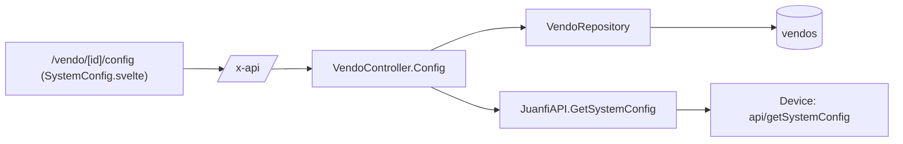

# Vendo System Configuration — Technical Documentation

> Audience: human developers and AI assistants.
> Scope: reading a vendo machine's persistent device configuration (`api/getSystemConfig`) and the (currently unwired) `api/saveSystemConfig` write path.
> Cross-cutting concerns (auth, ACL, device API, error shape) are in [README.md](README.md).

---

# Overview

## Purpose
- Let operators view the full configuration currently programmed onto a Juanfi vendo machine — network, Mikrotik, admin/operator credentials, coin slot, GPIO pin assignments, LCD, voucher, internet-check, and thermal-printing settings — without opening the device's own admin console.

## Responsibilities
- Fetch and parse `api/getSystemConfig`'s pipe-delimited response into a typed `SystemConfig` struct.
- Serve it read-only to the PWA behind a dedicated permission.
- Provide (but not yet expose over HTTP) the inverse write path, `SaveSystemConfig`, so a future "edit and push" feature doesn't have to redo the encoding work.

## Scope
- **In scope:** `GET /vendo-machines/:id/config`, the `SystemConfig` struct and its parsing/encoding, the `/vendo/[id]/config` PWA page, the `vendoconfig` permission.
- **Out of scope:** writing configuration back to a device (service method exists, no route — see [Future Considerations](#future-considerations)); rate plans (see [vendo-rates.md](vendo-rates.md)); live status/active-users (see [vendo-machines.md](vendo-machines.md)).

---

# Architecture

## How it fits into the system
- Lives in the same controller/service as the other vendo live-device reads (`Status`, `ActiveUsers`), but — unlike those — is gated by its own permission rather than riding on `vendos`, because the payload includes device credentials.

## Upstream dependencies
- `VendoRepository.GetByID` — resolves the vendo (and its `api_url`/`api_key`) for the device call.
- `authz.CanAccessVendo` — per-vendo row-level check.
- `middleware.RequirePermission(models.PermVendoConfig)` — feature gate.

## Downstream consumers
- PWA: `/vendo/[id]/config/+page.svelte` → `SystemConfig.svelte`; the "System configuration" action in `VendoTable.svelte`'s row dropdown.
- Nothing else in the backend reads `SystemConfig`.

---

# Data Flow

## Inputs
| Input | Source | Shape |
|---|---|---|
| Device config string | Device → service | 51 `\|`-delimited positional fields (no `#` sub-delimiting, unlike rates/logs) |
| `:id` | PWA → REST | Vendo ID (uint) |

## Processing steps
- `GET /vendo-machines/:id/config` → `Config` handler: `parseID` → `CanAccessVendo` → `vendoRepo.GetByID` → `JuanfiAPI.GetSystemConfig()` → return the struct as raw JSON (not wrapped in `{data:...}`, matching `Status`'s convention).
- `GetSystemConfig()`: GET `api/getSystemConfig` → split on `|` → require at least 47 fields → assign indices 0–46 to named struct fields → anything beyond index 46 is kept verbatim in `ExtraFields`.
- `SaveSystemConfig(cfg)` *(implemented, not routed)*: `encodeSystemConfig` rejoins the named fields in the same order, appends `ExtraFields`, POSTs `data=<encoded>` to `api/saveSystemConfig`.

## Outputs
| Output | Destination | Shape |
|---|---|---|
| Live config | PWA | `SystemConfig` JSON object (snake_case keys, see [API / Interface](#api--interface)) |

## Device wire format — confidence levels (read this before trusting a field)

The raw response is **51 positional fields** with no labels. There is no current access to the firmware source for the build that produces 51 fields, so the mapping below was reverse-engineered from two sources:

1. **An older Juanfi admin console's `populateSystemConfigFields()` JS** (firmware ~2.3), which explicitly assigns `configData[0..29]` to named form inputs. That JS's first 30 fields were cross-checked against a live sample/screenshot from the *current* (51-field) firmware and matched **byte-for-byte** — same values, same order. This is the most reliable evidence we have.
2. **Exact-value matching** between a live device's admin-panel screenshot and a sample `getSystemConfig` response/`saveSystemConfig` form payload for the same device, for fields added after index 29 (the old JS doesn't cover these).

| Index | Struct field | Confidence | Basis |
|---|---|---|---|
| 0 | `VendoName` | High | Old-JS position |
| 1 | `WiFiSSID` | High | Old-JS position |
| 2 | `WiFiPassword` | High | Old-JS position |
| 3 | `MikrotikIP` | High | Old-JS position + exact value match |
| 4 | `MikrotikUsername` | High | Old-JS position + exact value match |
| 5 | `MikrotikPassword` | High | Old-JS position |
| 6 | `CoinSlotWaitTimeSec` | High | Old-JS position + exact value match (`30`) |
| 7 | `AdminUsername` | High | Old-JS position + exact value match (`admin`) |
| 8 | `AdminPassword` | High | Old-JS position |
| 9 | `CoinSlotAbuseCount` | High | Old-JS position + exact value match (`3`) |
| 10 | `CoinSlotBanMinutes` | High | Old-JS position + exact value match (`30`) |
| 11 | `CoinSlotPin` | High | Old-JS position + value matches old pin enum for `D4` |
| 12 | `CoinSlotSetPin` | High | Old-JS position + value matches old pin enum for `D8` |
| 13 | `SystemReadyLEDPin` | High | Old-JS position (sentinel `-1`/NONE is new, position is not) |
| 14 | `InsertCoinLEDPin` | High | Old-JS position |
| 15 | `LCDScreen` | High | Old-JS position + exact value match (`None`→`0`) |
| 16 | `InsertCoinButtonPin` | High | Old-JS position + value matches old pin enum for `RX` |
| 17 | `CheckInternetStatus` | High | Old-JS position + exact value match (`No`→`0`) |
| 18 | `VoucherPrefix` | High | Old-JS position + exact value match (`HM`) |
| 19 | `WelcomeLCDMarquee` | High | Old-JS position + exact value match (`Tara Hulog na!!!`) |
| 20 | `SetupDoneFlag` | High | Old-JS position |
| 21 | `VoucherLoginOption` | High | Old-JS position + exact value match |
| 22 | `VoucherProfile` | High | Old-JS position + exact value match (`default`) |
| 23 | `VoucherValidity` | High | Old-JS position + exact value match |
| 24 | `LEDTriggerType` | High | Old-JS position + exact value match (`HIGH`→`1`) |
| 25 | `IPAddressMode` | High | Old-JS position + exact value match (`DHCP`→`0`) |
| 26 | `LocalIPAddress` | High | Old-JS position |
| 27 | `GatewayIP` | High | Old-JS position |
| 28 | `SubnetMask` | High | Old-JS position |
| 29 | `DNSServer` | High | Old-JS position |
| 30 | `ConnectionMode` | **Low** | Positional guess — old JS ends at 29; no independent value check |
| 31 | `CoinSlotType` | **Low** | Positional guess |
| 32 | `ButtonFunction` | **Low** | Positional guess |
| 33 | `OperatorUsername` | Medium-High | Exact value match (`operator`) against screenshot |
| 34 | `OperatorPassword` | Medium | Adjacent to 33; value present but not independently distinctive |
| 35 | `APIKey` | Medium | Plausible position (random alnum string, distinct shape) — **not** independently value-confirmed (sample screenshot showed a different device's key) |
| 36 | `BillAcceptorPin` | **Low** | Positional guess; `-1` is consistent with the NONE sentinel pattern seen at 13/14 |
| 37 | `CoinMultiplier` | Medium | Value (`1`) matches screenshot, but `1` is too common in this payload to be a strong anchor alone — trust the elimination/ordering, not the value |
| 38 | `VoucherLength` | Medium-High | Exact value match (`4`), fairly distinctive |
| 39 | `NightLightPin` | **Low** | Positional guess |
| 40 | `LCDSDAPin` | **Low** | Positional guess |
| 41 | `LCDSCLPin` | **Low** | Positional guess |
| 42 | `LANCSPin` | **Low** | Positional guess |
| 43 | `PrinterPin` | **Low** | Positional guess |
| 44 | `BillAcceptorMultiplier` | Medium-High | Exact value match (`10`), fairly distinctive |
| 45 | `PrintOption` | **Low** | Positional guess |
| 46 | `IncludeVendoName` | Medium | Value (`0`/No) consistent with convention, but `0` is too common to be a strong anchor alone |
| 47–50 | `ExtraFields[0..3]` | N/A | Observed as blank/zero padding; no known UI field — preserved verbatim, never decoded |

**If you get access to the firmware source or another sample (ideally from a device in Static IP mode, and/or with distinct non-`0`/`1`/`-1` values in the Low-confidence fields), re-derive indices 30–46 and update this table plus the `// best-effort` comments in `juanfi_api.go`.**

---

# Business Rules

## Validation rules
- `GetSystemConfig` requires at least 47 `|`-delimited fields in the response; fewer → error, nothing is returned.
- `:id` must be a valid uint → 400 otherwise (`parseID`).

## Constraints
- The struct is **flat and positional** — there is no sub-delimiter for system config (unlike rates' `#`-separated entries), so adding a field means appending at the end, never reordering.

## Assumptions
- `SaveSystemConfig`'s wire format is identical to `GetSystemConfig`'s, in the same field order — confirmed by comparing a live `saveSystemConfig` form payload against a `getSystemConfig` response for the same device (byte-for-byte identical).
- `ExtraFields` exists specifically so a future `SaveSystemConfig` call round-trips fields this client doesn't understand, instead of zeroing them out.

## Invariants
- Encoding (`encodeSystemConfig`) always emits exactly the 47 named fields in struct-declaration order, followed by `ExtraFields` — this must stay in lockstep with `GetSystemConfig`'s parse order or a save would silently shift every field after the change.

---

# Dependencies

## Internal modules
| Module | Role |
|---|---|
| `internal/services/juanfi_api.go` | `SystemConfig` struct, `GetSystemConfig`, `SaveSystemConfig`, `encodeSystemConfig`. |
| `internal/controllers/vendo_controller.go` | `Config` handler. |
| `internal/models/permission.go` | `PermVendoConfig = "vendoconfig"`. |
| `app/app.go` | Route wiring under the `vendoconfig` permission group. |

## External services
- Juanfi device HTTP API: `GET api/getSystemConfig` (used); `POST api/saveSystemConfig` (implemented, not routed).

## Database tables
- None. This feature is a live device passthrough — nothing is persisted.

## Configuration
- No feature-specific environment variables. Relies on the vendo's own `api_url`/`api_key` columns.

---

# API / Interface

## Endpoints
| Method | Path | Handler | Access | Success |
|---|---|---|---|---|
| GET | `/vendo-machines/:id/config` | `VendoController.Config` | `vendoconfig` permission + `canAccessVendo(id)` | 200, raw `SystemConfig` JSON |

> Unlike most list/detail endpoints in this codebase, the success response is the bare `SystemConfig` object, not `{ "data": ... }` — matching `Status`'s convention, not `Get`'s.

## Parameters
- Path: `:id` = vendo ID (uint). Invalid → 400.

## Return values
- `SystemConfig` (see struct definition in `juanfi_api.go` for the full JSON key list — they're `snake_case` versions of the Go field names, e.g. `mikrotik_ip`, `admin_password`, `lcd_sda_pin`).

## Error cases
| Status | Cause |
|---|---|
| 400 | Invalid `:id`. |
| 401 | Missing/invalid JWT. |
| 403 | Missing `vendoconfig` permission, or vendo not assigned to user. |
| 404 | Vendo not found. |
| 502 | Device unreachable, non-200, or response has fewer than 47 fields. |

## Juanfi service methods
- `GetSystemConfig() (*SystemConfig, error)` — GET `api/getSystemConfig`, parse positional string.
- `SaveSystemConfig(*SystemConfig) error` — POST `api/saveSystemConfig`, body `data=<encoded>`, form-urlencoded. **Not wired to any route.**

---

# Security

## Authentication
- Bearer JWT required (standard project-wide middleware).

## Authorization
- Dedicated `vendoconfig` permission (`models.PermVendoConfig`), distinct from the general `vendos` permission, **because the payload includes plaintext device credentials**: Mikrotik, admin, and operator passwords, plus the device's remote API key.
- Per-vendo row scoping via `canAccessVendo`.
- Existing roles do **not** get this permission automatically — it must be granted explicitly via the Roles UI (same caveat as every newly added permission; see [README.md known limitations](README.md#known-system-wide-limitations)).

## Sensitive data handling
- The PWA masks password-like fields (`*_password`, `api_key`) behind a "Show/Hide" toggle by default — but the **full plaintext values are sent to the client** on every load; this is not a server-side redaction, only a client-side display choice. Treat the response itself as sensitive.
- No field is stripped or hashed server-side before returning — unlike `Vendo.APIKey` elsewhere (`json:"-"`), `SystemConfig` has no such protection.

---

# Performance

## Caching
- None. Every page load hits the device live (5s HTTP timeout via `JuanfiAPI`'s client).

## Concurrency
- Single device call per request; no shared mutable state.

## Scalability considerations
- Bounded by device latency, same as `Status`/`ActiveUsers`. Not used by the scheduler, so no polling-frequency concern.

---

# Failure Modes

## Expected failures
| Scenario | Result |
|---|---|
| Device offline/timeout | 502. |
| Device response shorter than 47 fields (older/different firmware) | 502 (`getSystemConfig response too short`). |
| User lacks `vendoconfig` | 403. |
| Unknown vendo | 404. |

## Recovery strategy
- Read-only and idempotent; safe to retry/refresh freely.

## Logging and monitoring
- Errors surface as `{ detail }` from the controller; the PWA shows "Unable to load configuration from the device." on any fetch failure.

---

# Related Components
- [vendo-machines.md](vendo-machines.md) — sibling live-device reads (`Status`, `ActiveUsers`) on the same controller/service.
- [vendo-rates.md](vendo-rates.md) — the other Juanfi device wire-format feature, useful for comparing parsing conventions (`#`/`|` for rates vs flat `|` here).
- Roles & Permissions (`permission.go`, Roles UI) — owns the `vendoconfig` permission.

---

# Future Considerations

## Known limitations
- Indices 30, 31, 32, 36, 39–43, 45 (`ConnectionMode`, `CoinSlotType`, `ButtonFunction`, `BillAcceptorPin`, `NightLightPin`, `LCDSDAPin`, `LCDSCLPin`, `LANCSPin`, `PrinterPin`, `PrintOption`) are **unverified positional guesses** — see the confidence table above. Do not build write/edit functionality on top of these without re-verifying against firmware source or more device samples.
- No write endpoint exists yet for `SaveSystemConfig`, even though the service method is implemented — there is currently no way to edit configuration from the PWA.

## Technical debt
- Pin-number enums (which raw integer means which physical pin label, e.g. `D1`/`D2`/`RX`) are only known for the *old* firmware's pin set (indices 11, 12, 16). The newer pin fields (SDA/SCL/LAN CS/Night Light/Bill Acceptor/Printer) are displayed as raw integers in the PWA rather than decoded labels, because the new enum isn't known.

## Planned improvements
- Wire `SaveSystemConfig` to a `POST /vendo-machines/:id/config` route once the field mapping is fully verified, gated on the same `vendoconfig` permission, with a confirmation step given it triggers a device restart.
- Decode the remaining Low-confidence dropdown/pin fields into human-readable labels once their enums are confirmed.
