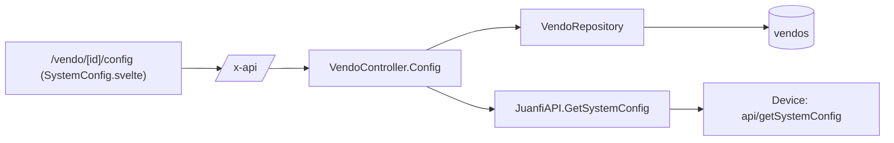

# Vendo System Configuration — Technical Documentation

> Audience: human developers and AI assistants.
> Scope: reading a vendo machine's persistent device configuration (`api/getSystemConfig`) and the (currently unwired) `api/saveSystemConfig` write path.
> Cross-cutting concerns (auth, ACL, device API, error shape) are in [README.md](README.md).

---

# Overview

## Purpose
- Let operators view the full configuration currently programmed onto a Juanfi vendo machine — network, Mikrotik, admin/operator credentials, coin slot, GPIO pin assignments, LCD, voucher, internet-check, and thermal-printing settings — without opening the device's own admin console.

## Responsibilities
- Fetch and parse `api/getSystemConfig`'s pipe-delimited response into a typed `SystemConfig` struct.
- Serve it read-only to the PWA behind a dedicated permission.
- Provide (but not yet expose over HTTP) the inverse write path, `SaveSystemConfig`, so a future "edit and push" feature doesn't have to redo the encoding work.

## Scope
- **In scope:** `GET /vendo-machines/:id/config`, the `SystemConfig` struct and its parsing/encoding, the `/vendo/[id]/config` PWA page, the `vendoconfig` permission.
- **Out of scope:** writing configuration back to a device (service method exists, no route — see [Future Considerations](#future-considerations)); rate plans (see [vendo-rates.md](vendo-rates.md)); live status/active-users (see [vendo-machines.md](vendo-machines.md)).

---

# Architecture

## How it fits into the system
- Lives in the same controller/service as the other vendo live-device reads (`Status`, `ActiveUsers`), but — unlike those — is gated by its own permission rather than riding on `vendos`, because the payload includes device credentials.

## Upstream dependencies
- `VendoRepository.GetByID` — resolves the vendo (and its `api_url`/`api_key`) for the device call.
- `authz.CanAccessVendo` — per-vendo row-level check.
- `middleware.RequirePermission(models.PermVendoConfig)` — feature gate.

## Downstream consumers
- PWA: `/vendo/[id]/config/+page.svelte` → `SystemConfig.svelte`; the "System configuration" action in `VendoTable.svelte`'s row dropdown.
- Nothing else in the backend reads `SystemConfig`.

---

# Data Flow

## Inputs
| Input | Source | Shape |
|---|---|---|
| Device config string | Device → service | Up to 61 `\|`-delimited positional fields, indices 0–60 (no `#` sub-delimiting, unlike rates/logs); older devices emit fewer trailing fields |
| `:id` | PWA → REST | Vendo ID (uint) |

## Processing steps
- `GET /vendo-machines/:id/config` → `Config` handler: `parseID` → `CanAccessVendo` → `vendoRepo.GetByID` → `JuanfiAPI.GetSystemConfig()` → return the struct as raw JSON (not wrapped in `{data:...}`, matching `Status`'s convention).
- `GetSystemConfig()`: GET `api/getSystemConfig` → split on `|` → require at least 47 fields → assign indices 0–46 to named struct fields → anything beyond index 46 is kept verbatim in `ExtraFields`. **Note:** this reflects current code, which is now known to mislabel indices 30–46 and to treat the real fields 47–60 as `ExtraFields` — see [the divergence summary](#the-go-systemconfig-struct-is-out-of-sync).
- `SaveSystemConfig(cfg)` *(implemented, not routed)*: `encodeSystemConfig` rejoins the named fields in the same order, appends `ExtraFields`, POSTs `data=<encoded>` to `api/saveSystemConfig`.

## Outputs
| Output | Destination | Shape |
|---|---|---|
| Live config | PWA | `SystemConfig` JSON object (snake_case keys, see [API / Interface](#api--interface)) |

## Device wire format — index → field mapping (firmware 4.3, verified)

The raw response is a **`|`-delimited positional list of up to 61 fields (indices 0–60)**, no labels. As of firmware **release-4.3** we have the device source (`WirelessBase/ESP32/extracted/admin/js/admin.js`), so the mapping below is **confirmed** — no longer reverse-engineered.

**Source of truth** — read and write are symmetric, so each index → field identity is unambiguous:
- **Read:** `populateSystemConfigFields(data)` splits on `|` and assigns `configData[0..60]` to named form fields.
- **Write:** `saveSystemConfig()` → `createParam([...])` rejoins the same 61 fields with `|` in the same order.

> Older/less-configured devices emit **fewer trailing fields** — a real production sample had 51 (indices 0–50, with 51–60 absent). The firmware reader tolerates this via `!= null && != ""` guards with built-in defaults, so a short response is valid; the earlier "51 fields" figure is this same layout with the tail omitted, **not** a different format.

Column 2 is the **firmware form-field id** (authoritative); indices 0–29 also match the same-named Go struct fields. Where the current Go `SystemConfig` struct disagrees (indices 30+), the Basis column says so — see the divergence summary after the table.

| Index | Field | Confidence | Basis |
|---|---|---|---|
| 0 | `VendoName` | High | Old-JS position |
| 1 | `WiFiSSID` | High | Old-JS position |
| 2 | `WiFiPassword` | High | Old-JS position |
| 3 | `MikrotikIP` | High | Old-JS position + exact value match |
| 4 | `MikrotikUsername` | High | Old-JS position + exact value match |
| 5 | `MikrotikPassword` | High | Old-JS position |
| 6 | `CoinSlotWaitTimeSec` | High | Old-JS position + exact value match (`30`) |
| 7 | `AdminUsername` | High | Old-JS position + exact value match (`admin`) |
| 8 | `AdminPassword` | High | Old-JS position |
| 9 | `CoinSlotAbuseCount` | High | Old-JS position + exact value match (`3`) |
| 10 | `CoinSlotBanMinutes` | High | Old-JS position + exact value match (`30`) |
| 11 | `CoinSlotPin` | High | Old-JS position + value matches old pin enum for `D4` |
| 12 | `CoinSlotSetPin` | High | Old-JS position + value matches old pin enum for `D8` |
| 13 | `SystemReadyLEDPin` | High | Old-JS position (sentinel `-1`/NONE is new, position is not) |
| 14 | `InsertCoinLEDPin` | High | Old-JS position |
| 15 | `LCDScreen` | High | Old-JS position + exact value match (`None`→`0`) |
| 16 | `InsertCoinButtonPin` | High | Old-JS position + value matches old pin enum for `RX` |
| 17 | `CheckInternetStatus` | High | Old-JS position + exact value match (`No`→`0`) |
| 18 | `VoucherPrefix` | High | Old-JS position + exact value match (`HM`) |
| 19 | `WelcomeLCDMarquee` | High | Old-JS position + exact value match (`Tara Hulog na!!!`) |
| 20 | `SetupDoneFlag` | High | Old-JS position |
| 21 | `VoucherLoginOption` | High | Old-JS position + exact value match |
| 22 | `VoucherProfile` | High | Old-JS position + exact value match (`default`) |
| 23 | `VoucherValidity` | High | Old-JS position + exact value match |
| 24 | `LEDTriggerType` | High | Old-JS position + exact value match (`HIGH`→`1`) |
| 25 | `IPAddressMode` | High | Old-JS position + exact value match (`DHCP`→`0`) |
| 26 | `LocalIPAddress` | High | Old-JS position |
| 27 | `GatewayIP` | High | Old-JS position |
| 28 | `SubnetMask` | High | Old-JS position |
| 29 | `DNSServer` | High | Old-JS position |
| 30 | `coinSlotType` | Confirmed | fw4.3 `admin.js` (`1`=Universal/multicoin, `2`=single-coin sensor) — Go struct wrongly has `ConnectionMode` here |
| 31 | `singleCoinPulseCount` | Confirmed | fw4.3 — pulse count for single-coin sensor; **not modeled by Go struct** |
| 32 | `mtConnectionMode` | Confirmed | fw4.3 — Mikrotik `1`=Keep Alive, `2`=On Demand; this is the real "connection mode" (Go put `ConnectionMode` at 30) |
| 33 | `operatorUser` | Confirmed | fw4.3 — matches Go `OperatorUsername` ✓ |
| 34 | `operatorPw` | Confirmed | fw4.3 — matches Go `OperatorPassword` ✓ |
| 35 | `apiKey` | Confirmed | fw4.3 — matches Go `APIKey` ✓ |
| 36 | `nightLightPin` | Confirmed | fw4.3 — Go wrongly has `BillAcceptorPin` |
| 37 | `buttonFunction` | Confirmed | fw4.3 (`0`=Clear+Buy, `1`=Clear only) — Go wrongly has `CoinMultiplier` |
| 38 | `voucherLength` | Confirmed | fw4.3 — matches Go `VoucherLength` ✓ |
| 39 | `coinMultiplier` | Confirmed | fw4.3 — Go wrongly has `NightLightPin` |
| 40 | `lanModeOverride` | Confirmed | fw4.3 — **internal** LAN-migration flag, forced `1` on save (not a user field); Go wrongly has `LCDSDAPin` |
| 41 | `lcdSDAPin` | Confirmed | fw4.3 — Go wrongly has `LCDSCLPin` |
| 42 | `lcdSCLPin` | Confirmed | fw4.3 — Go wrongly has `LANCSPin` |
| 43 | `billAcceptorPin` | Confirmed | fw4.3 — Go wrongly has `PrinterPin` |
| 44 | `billAcceptorMultiplier` | Confirmed | fw4.3 — matches Go `BillAcceptorMultiplier` ✓ |
| 45 | `thermalPrinterPin` | Confirmed | fw4.3 ("Printer Pin") — Go wrongly has `PrintOption` |
| 46 | `printOption` | Confirmed | fw4.3 (`0`=Never … `4`=Only when profile is) — Go wrongly has `IncludeVendoName` |
| 47 | `printOptionCriteria` | Confirmed | fw4.3 — profile name used when `printOption`=4; Go treats as `ExtraFields[0]` |
| 48 | `lanCSPin` | Confirmed | fw4.3 — LAN module chip-select pin; Go `ExtraFields[1]` |
| 49 | `persistLogs` | Confirmed | fw4.3 (`0`/`1`); Go `ExtraFields[2]` |
| 50 | `includeVendoName` | Confirmed | fw4.3 (`0`/`1`) — the real `IncludeVendoName`; Go `ExtraFields[3]` |
| 51 | `welcomeTextFirstLine` | Confirmed | fw4.3 (LCD line 1, default `Welcome to`); not modeled by Go struct |
| 52 | `welcomeTextThirdLine` | Confirmed | fw4.3 (LCD line 3, 20x4 only) |
| 53 | `insertCoinText` | Confirmed | fw4.3 (LCD "insert coin" text) |
| 54 | `thankYouText` | Confirmed | fw4.3 (default `Thank you!`) |
| 55 | `restartSchedule` | Confirmed | fw4.3 (auto-restart schedule, `0`=disabled) |
| 56 | `blackoutDetection` | Confirmed | fw4.3 (A0+3V button: `0`=disable, `1`=factory reset, `2`=run MT script) |
| 57 | `buzzerPin` | Confirmed | fw4.3 (buzzer GPIO pin) |
| 58 | `printerBaudRate` | Confirmed | fw4.3 (default `9600`) |
| 59 | `pulseToBlock` | Confirmed | fw4.3 (default `20`) |
| 60 | `thankYouTimeout` | Confirmed | fw4.3 (thank-you display seconds, default `30`) |

### The Go `SystemConfig` struct is out of sync

`internal/services/juanfi_api.go` was written before the firmware was available: it models indices **0–46** and dumps everything past 46 into `ExtraFields`. **Indices 0–29 are correct**, but the "newer firmware" block (30–46) was guessed and is mostly **wrong**, and **47–60 are real named fields, not padding**. Only 33, 34, 35, 38, 44 happen to sit at the right index.

| Index | Go struct field (wrong) | Actual (firmware 4.3) |
|---|---|---|
| 30 | `ConnectionMode` | `coinSlotType` |
| 31 | `CoinSlotType` | `singleCoinPulseCount` |
| 32 | `ButtonFunction` | `mtConnectionMode` (the real connection mode) |
| 36 | `BillAcceptorPin` | `nightLightPin` |
| 37 | `CoinMultiplier` | `buttonFunction` |
| 39 | `NightLightPin` | `coinMultiplier` |
| 40 | `LCDSDAPin` | `lanModeOverride` (internal flag) |
| 41 | `LCDSCLPin` | `lcdSDAPin` |
| 42 | `LANCSPin` | `lcdSCLPin` |
| 43 | `PrinterPin` | `billAcceptorPin` |
| 45 | `PrintOption` | `thermalPrinterPin` |
| 46 | `IncludeVendoName` | `printOption` |
| 47–50 | `ExtraFields[0..3]` (assumed padding) | `printOptionCriteria`, `lanCSPin`, `persistLogs`, `includeVendoName` |
| 51–60 | *(unmodeled)* | `welcomeTextFirstLine`, `welcomeTextThirdLine`, `insertCoinText`, `thankYouText`, `restartSchedule`, `blackoutDetection`, `buzzerPin`, `printerBaudRate`, `pulseToBlock`, `thankYouTimeout` |

**Consequence:** `GetSystemConfig` currently returns mislabeled values for roughly half the fields, and a `SaveSystemConfig` built on the current struct would shift every field from index 30 on. **Do not wire the write path** until the struct is re-ordered to match the table above (indices 0–60, no `ExtraFields`). Tracked in [Future Considerations](#future-considerations).

---

# Business Rules

## Validation rules
- `GetSystemConfig` requires at least 47 `|`-delimited fields in the response; fewer → error, nothing is returned.
- `:id` must be a valid uint → 400 otherwise (`parseID`).

## Constraints
- The struct is **flat and positional** — there is no sub-delimiter for system config (unlike rates' `#`-separated entries), so adding a field means appending at the end, never reordering.

## Assumptions
- `SaveSystemConfig`'s wire format is identical to `GetSystemConfig`'s, in the same field order — confirmed by comparing a live `saveSystemConfig` form payload against a `getSystemConfig` response for the same device (byte-for-byte identical).
- `ExtraFields` exists specifically so a future `SaveSystemConfig` call round-trips fields this client doesn't understand, instead of zeroing them out.

## Invariants
- Encoding (`encodeSystemConfig`) always emits exactly the 47 named fields in struct-declaration order, followed by `ExtraFields` — this must stay in lockstep with `GetSystemConfig`'s parse order or a save would silently shift every field after the change.

---

# Dependencies

## Internal modules
| Module | Role |
|---|---|
| `internal/services/juanfi_api.go` | `SystemConfig` struct, `GetSystemConfig`, `SaveSystemConfig`, `encodeSystemConfig`. |
| `internal/controllers/vendo_controller.go` | `Config` handler. |
| `internal/models/permission.go` | `PermVendoConfig = "vendoconfig"`. |
| `app/app.go` | Route wiring under the `vendoconfig` permission group. |

## External services
- Juanfi device HTTP API: `GET api/getSystemConfig` (used); `POST api/saveSystemConfig` (implemented, not routed).

## Database tables
- None. This feature is a live device passthrough — nothing is persisted.

## Configuration
- No feature-specific environment variables. Relies on the vendo's own `api_url`/`api_key` columns.

---

# API / Interface

## Endpoints
| Method | Path | Handler | Access | Success |
|---|---|---|---|---|
| GET | `/vendo-machines/:id/config` | `VendoController.Config` | `vendoconfig` permission + `canAccessVendo(id)` | 200, raw `SystemConfig` JSON |

> Unlike most list/detail endpoints in this codebase, the success response is the bare `SystemConfig` object, not `{ "data": ... }` — matching `Status`'s convention, not `Get`'s.

## Parameters
- Path: `:id` = vendo ID (uint). Invalid → 400.

## Return values
- `SystemConfig` (see struct definition in `juanfi_api.go` for the full JSON key list — they're `snake_case` versions of the Go field names, e.g. `mikrotik_ip`, `admin_password`, `lcd_sda_pin`).

## Error cases
| Status | Cause |
|---|---|
| 400 | Invalid `:id`. |
| 401 | Missing/invalid JWT. |
| 403 | Missing `vendoconfig` permission, or vendo not assigned to user. |
| 404 | Vendo not found. |
| 502 | Device unreachable, non-200, or response has fewer than 47 fields. |

## Juanfi service methods
- `GetSystemConfig() (*SystemConfig, error)` — GET `api/getSystemConfig`, parse positional string.
- `SaveSystemConfig(*SystemConfig) error` — POST `api/saveSystemConfig`, body `data=<encoded>`, form-urlencoded. **Not wired to any route.**

---

# Security

## Authentication
- Bearer JWT required (standard project-wide middleware).

## Authorization
- Dedicated `vendoconfig` permission (`models.PermVendoConfig`), distinct from the general `vendos` permission, **because the payload includes plaintext device credentials**: Mikrotik, admin, and operator passwords, plus the device's remote API key.
- Per-vendo row scoping via `canAccessVendo`.
- Existing roles do **not** get this permission automatically — it must be granted explicitly via the Roles UI (same caveat as every newly added permission; see [README.md known limitations](README.md#known-system-wide-limitations)).

## Sensitive data handling
- The PWA masks password-like fields (`*_password`, `api_key`) behind a "Show/Hide" toggle by default — but the **full plaintext values are sent to the client** on every load; this is not a server-side redaction, only a client-side display choice. Treat the response itself as sensitive.
- No field is stripped or hashed server-side before returning — unlike `Vendo.APIKey` elsewhere (`json:"-"`), `SystemConfig` has no such protection.

---

# Performance

## Caching
- None. Every page load hits the device live (5s HTTP timeout via `JuanfiAPI`'s client).

## Concurrency
- Single device call per request; no shared mutable state.

## Scalability considerations
- Bounded by device latency, same as `Status`/`ActiveUsers`. Not used by the scheduler, so no polling-frequency concern.

---

# Failure Modes

## Expected failures
| Scenario | Result |
|---|---|
| Device offline/timeout | 502. |
| Device response shorter than 47 fields (older/different firmware) | 502 (`getSystemConfig response too short`). |
| User lacks `vendoconfig` | 403. |
| Unknown vendo | 404. |

## Recovery strategy
- Read-only and idempotent; safe to retry/refresh freely.

## Logging and monitoring
- Errors surface as `{ detail }` from the controller; the PWA shows "Unable to load configuration from the device." on any fetch failure.

---

# Related Components
- [vendo-machines.md](vendo-machines.md) — sibling live-device reads (`Status`, `ActiveUsers`) on the same controller/service.
- [vendo-rates.md](vendo-rates.md) — the other Juanfi device wire-format feature, useful for comparing parsing conventions (`#`/`|` for rates vs flat `|` here).
- Roles & Permissions (`permission.go`, Roles UI) — owns the `vendoconfig` permission.

---

# Future Considerations

## Known limitations
- **The Go `SystemConfig` struct is out of sync with the verified firmware 4.3 layout** (see the [divergence summary](#the-go-systemconfig-struct-is-out-of-sync)): indices 30–46 are mislabeled, 47–50 are treated as `ExtraFields` when they are the real `printOptionCriteria`/`lanCSPin`/`persistLogs`/`includeVendoName`, and 51–60 are not modeled at all. `GetSystemConfig` therefore returns wrong labels for ~half the payload today. The mapping table is now authoritative; the struct needs to be re-ordered to match before it can be trusted.
- No write endpoint exists yet for `SaveSystemConfig`, even though the service method is implemented — there is currently no way to edit configuration from the PWA. It must not be wired until the struct is corrected (a save on the current struct would shift every field from index 30 on).

## Technical debt
- Pin-number enums (which raw integer means which physical pin label, e.g. `D1`/`D2`/`RX`) are only known for the *old* firmware's pin set (indices 11, 12, 16). The newer pin fields (SDA/SCL/LAN CS/Night Light/Bill Acceptor/Printer) are displayed as raw integers in the PWA rather than decoded labels, because the new enum isn't known.

## Planned improvements
- **Re-order the `SystemConfig` struct to the verified firmware 4.3 layout** (indices 0–60, drop `ExtraFields`, keeping parse/encode in lockstep) so `GetSystemConfig` returns correct labels — this is now a correctness fix, not a nice-to-have, since the mapping is verified.
- Then wire `SaveSystemConfig` to a `POST /vendo-machines/:id/config` route, gated on the same `vendoconfig` permission, with a confirmation step given it triggers a device restart.
- Decode dropdown/pin values into human-readable labels using the option lists in `admin/system-config.html` (e.g. `lcdScreen` `0`/`1`/`2` = None/16x2/20x4, `mtConnectionMode` `1`/`2` = Keep Alive/On Demand, `printOption` `0..4`).
