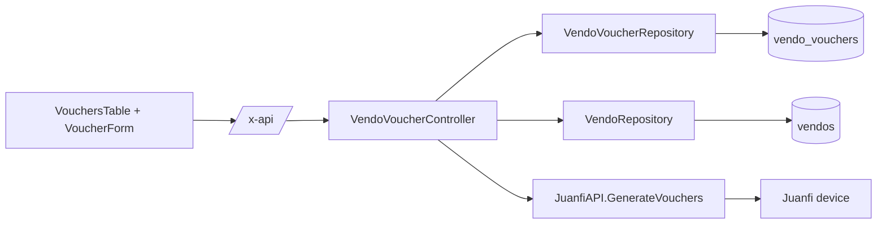

# Vendo Vouchers — Technical Documentation

> Audience: human developers and AI assistants.
> Scope: generated voucher listing and voucher generation for one vendo machine.
> Cross-cutting concerns (auth, ACL, device API, error shape) are in [README.md](README.md).

---

# Overview

## Purpose
- Generate prepaid WiFi vouchers on a Juanfi-firmware vendo machine and persist the generated codes in VendoReport.
- Give operators a per-vendo history of generated voucher codes, amounts, durations, and generation options.

## Responsibilities
- Call the Juanfi `api/generateVouchers` endpoint for a selected vendo.
- Validate voucher generation input before calling the device.
- Persist generated voucher rows in `vendo_vouchers`.
- Enforce the `vouchers` permission and per-vendo access.
- Provide a PWA page for listing and generating vouchers.

## Scope
- **In scope:** `vendo_vouchers` persistence, voucher list/generate REST endpoints, Juanfi voucher generation client method, and the PWA voucher page/components.
- **Out of scope:** sales records created by device purchases (`vendo_sales`), rate-plan configuration (`vendo_rates`), and device firmware behavior.

---

# Architecture

## How it fits into the system
- Backend follows the existing feature shape: `controllers -> repository -> DB` and `controllers -> services -> device`.
- Frontend calls the API only through `/x-api/`, so the JWT stays in the httpOnly cookie and is injected by the SvelteKit proxy.



## Upstream dependencies
- **Auth middleware:** validates JWT and loads the current user.
- **Permission middleware:** `RequirePermission(models.PermVouchers)` gates all voucher endpoints.
- **ACL helpers:** `canAccessVendo(c, id)` enforces row-level vendo access.
- **Vendo repository:** loads device `api_url` and `api_key` for generation.
- **Juanfi service:** posts generation requests to the device.

## Downstream consumers
- PWA route: `/vendo/[id]/vouchers`.
- PWA components: `VouchersTable.svelte`, `VoucherForm.svelte`, and the VendoTable row action dropdown.
- No scheduler or background worker reads `vendo_vouchers`.

---

# Data Flow

## Inputs
| Input | Source | Shape |
|---|---|---|
| Vendo ID | Route param | `:id` as uint |
| Generate body | PWA -> REST | JSON: `prefix`, `amount`, `quantity`, `add_to_sales`, `print_thermal` |
| Device response | Device -> service | `VendoName|Amount|DurationMinutes|Code#Code#...` |

## Processing steps
- **List** (`GET /vendo-machines/:id/vouchers`): parse ID -> check `canAccessVendo` -> query `vendo_vouchers` ordered newest first -> return `{data}`.
- **Generate** (`POST /vendo-machines/:id/vouchers/generate`): parse ID -> check `canAccessVendo` -> validate body -> load vendo -> call `JuanfiAPI.GenerateVouchers` -> map device vouchers to `VendoVoucher` rows -> insert batch -> return `{data}`.

## Outputs
| Output | Destination | Shape |
|---|---|---|
| Generated voucher rows | `vendo_vouchers` table | One row per generated code |
| List/generate responses | PWA | `{ "data": VendoVoucher[] }` |
| Device request | Juanfi device | POST form body with `amt`, `pfx`, `qty`, `sales`, `print` |

## Device wire format
- Endpoint: `POST <api_url>/admin/api/generateVouchers?query=<unix-ms>`.
- Headers: `X-TOKEN: <api_key>`, `Content-Type: application/x-www-form-urlencoded; charset=UTF-8`.
- Form fields:
  - `amt`: amount/price requested.
  - `pfx`: voucher prefix.
  - `qty`: number of vouchers.
  - `sales`: `"1"` if generated vouchers should be added to device sales, else `"0"`.
  - `print`: `"1"` if the device should print via thermal printer, else `"0"`.
- Response example: `Your WiFi|2|2400|VC5416#VC2879`.
- The device chooses duration by matching `amount` against its configured rate plan.

---

# Business Rules

## Validation rules
- `prefix` is required and must match `^[A-Za-z][A-Za-z0-9]?$`.
  - Length: 1-2 characters.
  - First character must be a letter.
  - Second character, if present, may be a letter or digit.
- `amount` is required and must be greater than `0`.
- `quantity` is required and must be between `1` and `15`.
- `add_to_sales` and `print_thermal` are optional booleans; missing values default to `false`.

## Constraints
- Listing and generation are always scoped to one vendo.
- Generated rows are persisted only after the device returns voucher codes successfully.
- `vendo_vouchers` uses a plain scalar `VendoID` field and intentionally has no GORM association field to `Vendo`.
- A generation response may contain one or more voucher codes; each code becomes one database row with shared amount/duration metadata.

## Assumptions
- The device is the authority for generated voucher codes and duration.
- The requested `amount` must correspond to a device-configured rate for useful output; VendoReport does not pre-validate this against stored rates.
- Device-side effects may occur before VendoReport persists rows. A DB failure after a successful device call can leave generated codes on the device but absent from `vendo_vouchers`.

## Invariants
- Every `vendo_vouchers` row belongs to exactly one vendo (`vendo_id` is non-null).
- List order is newest first: `created_at DESC, id DESC`.
- Stored `added_to_sales` and `printed_thermal` reflect the request flags sent to the device.

---

# Dependencies

## Internal modules
| Module | Role |
|---|---|
| `internal/controllers/vendo_voucher_controller.go` | HTTP handlers, validation, ACL, device call orchestration. |
| `internal/models/vendo_voucher.go` | `VendoVoucher` GORM model and JSON shape. |
| `internal/repository/vendo_voucher_repository.go` | List and batch insert queries. |
| `internal/repository/interfaces.go` | `VendoVoucherRepositoryInterface`. |
| `internal/services/juanfi_api.go` | `GenerateVouchers`, response parsing, form POST. |
| `internal/models/permission.go` | `PermVouchers = "vouchers"` and `AllPermissions()`. |
| `app/app.go` | Route wiring under the `vouchers` permission group. |

## Frontend modules
| Module | Role |
|---|---|
| `src/routes/(auth)/vendo/[id]/vouchers/+page.server.ts` | Permission gate and vendo access probe. |
| `src/routes/(auth)/vendo/[id]/vouchers/+page.svelte` | Page shell. |
| `src/routes/(auth)/vendo/[id]/vouchers/+page.ts` | Exposes `params.id` to the page. |
| `src/lib/components/VouchersTable.svelte` | Fetches, displays, refreshes, and highlights generated vouchers. |
| `src/lib/components/VoucherForm.svelte` | Client-side generation form and validation. |
| `src/routes/(auth)/vendo/VendoTable.svelte` | Shows the "Manage vouchers" row action when the user has `vouchers`. |
| `src/lib/types/models.ts` | `iVendoVoucher` and permission list entry. |

## External services
- Juanfi device HTTP API: `api/generateVouchers`.

## Database tables
| Table | Columns |
|---|---|
| `vendo_vouchers` | `id`, `vendo_id`, `code`, `prefix`, `amount`, `duration_minutes`, `added_to_sales`, `printed_thermal`, `created_at` |
| `vendos` | Provides `api_url` and `api_key` for the device call. |

## Configuration
- No feature-specific environment variables.
- Uses the global DB/JWT/CORS settings and the PWA `/x-api/` proxy.

---

# API / Interface

All paths are served by the Go API and reached from the PWA as `/x-api/<path>`. All require a valid Bearer JWT and the `vouchers` permission.

## Endpoints
| Method | Path | Handler | Extra ACL | Success |
|---|---|---|---|---|
| GET | `/vendo-machines/:id/vouchers` | `ListForVendo` | `canAccessVendo(id)` | 200 `{data: VendoVoucher[]}` |
| POST | `/vendo-machines/:id/vouchers/generate` | `Generate` | `canAccessVendo(id)` | 201 `{data: VendoVoucher[]}` |

## Generate request
```json
{
  "prefix": "VC",
  "amount": 10,
  "quantity": 1,
  "add_to_sales": false,
  "print_thermal": false
}
```

## Response row
```json
{
  "id": 1,
  "vendo_id": 1,
  "code": "VC5416",
  "prefix": "VC",
  "amount": 10,
  "duration_minutes": 2400,
  "added_to_sales": false,
  "printed_thermal": false,
  "created_at": "2026-06-30T16:55:17Z"
}
```

## Error cases
| Status | Cause |
|---|---|
| 400 | Invalid `:id`, invalid JSON body, invalid prefix, quantity outside `1..15`, amount <= 0. |
| 401 | Missing/invalid JWT. |
| 403 | Missing `vouchers` permission or lacking access to the vendo. |
| 404 | Vendo not found before generation. |
| 500 | Database list/insert error. |
| 502 | Device unreachable, non-200 from Juanfi, or unexpected generation response format. |

---

# Security

## Authentication
- Bearer JWT is required on all voucher endpoints.
- In the PWA, calls go through `/x-api/`; the JWT is injected server-side from the httpOnly `auth_token` cookie.

## Authorization
- **Feature gate:** all backend voucher routes require `models.PermVouchers`.
- **Row-level gate:** all operations require `canAccessVendo(id)`.
- Frontend mirrors the feature gate:
  - `/vendo/[id]/vouchers` redirects to `/home` without `vouchers`.
  - The VendoTable row action is shown only with `vouchers`.

## Sensitive data handling
- Device `api_key` is read only server-side from the vendo record and sent as `X-TOKEN` to the device.
- Generated voucher codes are credentials for WiFi access. Treat `vendo_vouchers.code` as sensitive operational data; do not log full codes in new server logs.

---

# Performance

## Caching
- None. Lists are read from the DB on demand.

## Concurrency
- Generation performs one synchronous device call with the standard Juanfi HTTP client timeout.
- Batch insert writes all returned codes in one GORM `Create` call.
- Frontend list loading uses an `AbortController` to cancel superseded requests.

## Scalability considerations
- Quantity is capped at 15 to avoid long device generation calls and overly large responses.
- `vendo_id` and `code` are indexed by the GORM model.
- List size is currently unpaginated; this is acceptable for modest per-vendo generation history but may need pagination if voucher volume grows.

---

# Failure Modes

## Expected failures
- Device offline or invalid device credentials -> 502.
- Amount not recognized by the device rate plan -> device-dependent failure or empty/unexpected response.
- Non-admin user without assigned vendo -> 403.
- DB insert failure after successful device generation -> generated vouchers exist on the device but are not recorded locally.

## Recovery strategy
- Listing failures are safe to retry.
- Generation is **not idempotent**. Retrying after a timeout or DB failure can create additional voucher codes on the device.
- If persistence fails after generation, reconcile manually from the device when possible.

## Logging and monitoring
- Handlers return `{ "detail": "<message>" }` on errors.
- No scheduler monitors voucher generation or voucher usage.

---

# Related Components
- [vendo-machines.md](vendo-machines.md) — shared vendo namespace and access model.
- [vendo-rates.md](vendo-rates.md) — device rate plans used by the firmware to determine voucher duration from amount.
- [sales-and-withdrawals.md](sales-and-withdrawals.md) — sales records created by voucher purchases/usage logs, separate from generated voucher history.
- [authentication-and-access.md](authentication-and-access.md) — role/permission behavior.

---

# Future Considerations

## Known limitations
- No pagination or search for generated vouchers.
- No delete/export/print-from-history action in the PWA.
- No idempotency key for generation.
- No pre-validation that `amount` exists in the vendo's current rate plan.

## Technical debt
- The controller performs orchestration directly; a service layer would be useful if generation gains reconciliation, auditing, or retry/idempotency logic.

## Planned improvements
- Add pagination/search for generated voucher history.
- Add CSV export or print actions for generated batches.
- Add an idempotency token or persisted generation batch table for safer retries.
